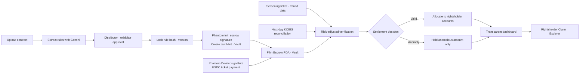
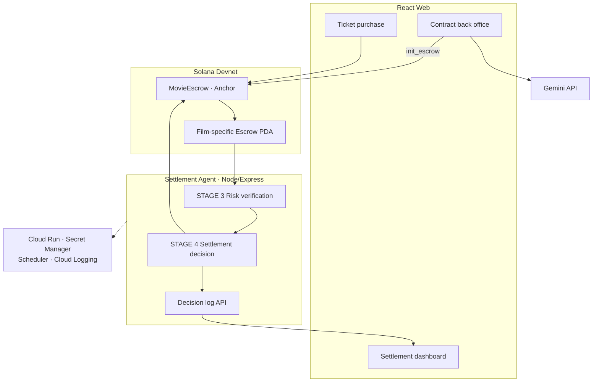

<div align="center">

**[한국어](README.md) · [English](README-ENG.md)**

<br />


<h1>MovieEscrow</h1>

**AI-powered on-chain settlement infrastructure that distributes independent-film ticket revenue by contract**

MovieEscrow turns film exhibition agreements into executable rules and isolates ticket
revenue in a film-specific escrow. Valid funds continue to the rightsholders while only
the amount under review is held separately.

<br />

[](https://chaincrew-web-612802760361.asia-northeast3.run.app)
[](docs/e2e/ChainCrew_Hackathon_Submission.html)

<br />

<em>AI does not decide how money is divided. Human-approved deterministic rules execute
the allocation, while AI interprets contracts, verifies inputs, and detects anomalies
before settlement.</em>

</div>

---

## Demo & Submission

| Deliverable    | Link / Status                                                                                                           |
| -------------- | ----------------------------------------------------------------------------------------------------------------------- |
| Live Demo      | [Run on Google Cloud Run](https://chaincrew-web-612802760361.asia-northeast3.run.app)                                   |
| Demo Video     | Public YouTube link will be added after upload                                                                          |
| Presentation   | View-only Canva link will be added after finalization                                                                   |
| Project Report | [HTML report](docs/e2e/ChainCrew_Hackathon_Submission.html) · [PDF report](docs/e2e/ChainCrew_Hackathon_Submission.pdf) |

Live Demo credentials are delivered separately through the hackathon submission channel.

---

## Overview

Film ticket revenue is commonly collected first by theater operators or ticketing
platforms and settled later with distributors, producers, and investors. If an
intermediary faces a liquidity crisis, rehabilitation, or bankruptcy, money already owed
to rightsholders may remain mixed with the intermediary's operating funds.

**MovieEscrow** routes ticket payments directly into a film-specific Solana escrow PDA,
separating settlement funds from operating capital. The AI agent verifies
human-approved contract rules, screening-level ticket and refund records, theater
history, and on-chain account state. Valid amounts are allocated to each rightsholder;
only the affected screening and amount are isolated as `Disputed`, after which each
rightsholder claims its own balance.

<p align="center">
  
</p>

<p align="center"><em>Valid funds keep moving through one escrow while only anomalous funds are isolated.</em></p>

Our initial users are **independent and art-house theaters, film festivals, and community
screening organizations** that can adopt a new settlement rail quickly. MovieEscrow is
not a consumer crypto product; it is **B2B settlement infrastructure** operating behind
the ticket purchase.

---

## Why We Built This

During Megabox JoongAng's 2026 rehabilitation proceedings, unpaid settlement balances
became a direct threat to producers, importers, distributors, and contracted theater
operators. The Korea Independent Film Association emphasized that these receivables are
part of the production-distribution-exhibition cycle and called for stronger protection
and segregation of settlement funds. Subsequent reporting estimated approximately KRW
15 billion in unpaid distributor balances and KRW 7–8 billion owed to more than 70
contracted theaters nationwide.

- [Korea Independent Film Association — Statement on Megabox JoongAng's unpaid settlement balances](https://kifv.org/725)
- [Yonhap News — Film industry liquidity crisis following Megabox troubles](https://www.yna.co.kr/view/AKR20260717054700005)

<table>
  <tr>
    <td width="50%"><a href="https://kifv.org/725"></a></td>
    <td width="50%"><a href="https://www.yna.co.kr/view/AKR20260717054700005"></a></td>
  </tr>
  <tr>
    <td align="center"><sub>Korea Independent Film Association · July 9, 2026</sub></td>
    <td align="center"><sub>Yonhap News · July 19, 2026</sub></td>
  </tr>
</table>

The core problem is not merely a lack of visible sales data. Money already paid by the
audience and owed to rightsholders is not segregated from an intermediary's operating
funds. The financial risk of one company can therefore spread across the cash flow of the
entire film ecosystem.

### What Comes After KOBIS

[KOBIS, the Korean Film Council's integrated box-office system](https://www.kobis.or.kr/kobis/business/main/main.do),
collects nationwide ticketing information and improves the transparency of box-office
sales and industry statistics. It does not, however, interpret each film's contract,
isolate rightsholder funds, or execute payment.

The timing of data transmission can vary by theater and ticketing provider. In a July
2026 field response, Cinecube explained that its ticketing provider transmits the prior
day's records in a daily batch early the following morning. MovieEscrow therefore does
not treat KOBIS as the sole real-time input immediately after purchase. Theater ledgers
and ticketing APIs provide the primary input, while KOBIS serves as a later reconciliation
source. [Field research notes](docs/research/CINECUBE_FIELD_RESPONSE_2026-07-31.md)

```text
KOBIS
→ records and aggregates how much was sold

MovieEscrow
→ confirms which contract rules apply
→ calculates deductions and each rightsholder's share
→ segregates funds
→ pays valid amounts
→ holds only anomalous amounts
```

> **If KOBIS is the data infrastructure that shows film revenue being generated,
> MovieEscrow is the execution infrastructure that connects that data to approved
> contract rules and actual fund flows—determining, segregating, and paying each
> rightsholder's share.**

---

## Problem

| Stakeholder                       | Current pain point                                                                                  |
| --------------------------------- | --------------------------------------------------------------------------------------------------- |
| Theater / exhibitor               | Revenue and settlement funds are mixed with operating capital, and manual settlement is burdensome. |
| Distributor / producer / investor | It is difficult to see when, how, and under which rule an amount was calculated.                    |
| Settlement operator               | Contract interpretation, deductions, ticket/refund reconciliation, and payment are fragmented.      |
| All rightsholders                 | One anomaly can stop even the valid portion of an entire settlement.                                |

The central problem is not simply that calculation is slow. **Rightsholder funds are not
protected from the moment of payment**, and third parties cannot immediately verify the
basis for calculation and execution.

---

## Solution

1. Gemini extracts revenue shares, fees, minimum guarantees, deductions, and settlement
   dates together with the supporting clauses.
2. The distributor and exhibitor review and approve the extracted terms.
3. After both approvals, a Phantom signature calls `init_escrow`, registering the
   contract hash, rule hash, version, and film-specific Vault on Solana.
4. Ticket payments flow directly into the film escrow Vault, which has no private key.
5. The settlement agent checks refund rates, complimentary tickets, and seat overflow
   against screening-level inputs, theater history, and on-chain state.
6. Valid screenings are allocated under the approved waterfall; only anomalous amounts
   are held.
7. The dashboard exposes status, balances, transactions, and the agent's reasoning.

> **Key differentiator — partial hold:** if only 50 out of 1,000 is anomalous, settlement
> of the valid 950 continues while only 50 is isolated. One issue does not stop the entire
> settlement.

---

## Key Features

| Feature                | Description                                                                                                |
| ---------------------- | ---------------------------------------------------------------------------------------------------------- |
| Contract → rule        | Gemini extracts settlement terms and evidence; `init_escrow` registers the approved rule hash and version. |
| Segregation at payment | Phantom-signed Devnet USDC enters the film escrow Vault directly instead of mixing with operating funds.   |
| Risk-adjusted checks   | Historical signals adjust thresholds for refunds, complimentary tickets, and seat overflow.                |
| Partial hold           | Only the affected screening and amount become `Disputed`; settlement of valid funds continues.             |
| Withdrawal protection  | Each rightsholder can claim only its own `Claimable` balance; overdraw attempts fail on-chain.             |
| Explainable decisions  | Gemini produces a readable report containing the applied policy, supporting clause, and hold reason.       |
| Transparent dashboard  | The state machine, rightsholder balances, Explorer links, and decision timeline are visible in one place.  |

---

## Product Walkthrough

<table>
  <tr>
    <td width="50%"></td>
    <td width="50%"></td>
  </tr>
  <tr>
    <td align="center"><strong>1. Upload the contract</strong><br /><sub>Extract settlement rules and supporting clauses from the exhibition agreement.</sub></td>
    <td align="center"><strong>2. Review conflicts and approve</strong><br /><sub>Conflicts block approval; only mutually confirmed rules are finalized.</sub></td>
  </tr>
  <tr>
    <td width="50%"></td>
    <td width="50%"></td>
  </tr>
  <tr>
    <td align="center"><strong>3. Pay and segregate</strong><br /><sub>Ticket revenue enters the film-specific Escrow Vault directly.</sub></td>
    <td align="center"><strong>4. Settle with partial holds</strong><br /><sub>View valid funds, held funds, and rightsholder balances together.</sub></td>
  </tr>
  <tr>
    <td width="50%"></td>
    <td width="50%"></td>
  </tr>
  <tr>
    <td align="center"><strong>5. Explain every decision</strong><br /><sub>Review the applied policy and evidence behind anomaly detection.</sub></td>
    <td align="center"><strong>6. Reconcile and verify</strong><br /><sub>Compare KOBIS information and Explorer records in one view.</sub></td>
  </tr>
</table>

---

## Settlement Flow



---

## System Architecture



| Service          | Responsibility                                               | Main connections                              |
| ---------------- | ------------------------------------------------------------ | --------------------------------------------- |
| React Web        | Contract approval, ticket purchase, settlement visualization | Gemini, Agent API, Solana                     |
| Settlement Agent | History lookup, validation, decision, chain execution        | Solana RPC, Gemini, Dashboard                 |
| MovieEscrow      | Segregation, allocation, partial hold, withdrawal protection | Solana Devnet                                 |
| Google Cloud     | Web and Agent deployment, authenticated scheduling, secrets  | Cloud Run, Secret Manager, Scheduler, Logging |

---

## Quick Start

### Prerequisites

| Area        | Requirement                   |
| ----------- | ----------------------------- |
| Web · Agent | Node.js 22.10+, npm 10+       |
| Blockchain  | Rust, Anchor 0.31, Solana CLI |
| AI          | Gemini API key                |
| Network     | Solana Localnet or Devnet     |

```bash
git clone https://github.com/chaincrew-kr/blockchain-hackathon.git
cd blockchain-hackathon
npm install
cp .env.example .env
```

| Service          | Command             | Default address / result             |
| ---------------- | ------------------- | ------------------------------------ |
| Web              | `npm run dev:web`   | `http://localhost:4020`              |
| Settlement Agent | `npm run dev:agent` | `http://localhost:4030/health`       |
| Full check       | `npm run check`     | lint · typecheck · test · formatting |

Local development can use `CHAIN_MODE=stub` without an external chain call. The submitted
Cloud Run Agent uses `anchor` mode and connects to Solana Devnet.

---

## Repository Structure

```text
blockchain-hackathon/
├── apps/
│   ├── web/                 # [A] Purchase · contract back office · dashboard
│   └── agent/               # [D] Risk checks · settlement decisions · log API
├── packages/
│   ├── ai-data/             # [A] Gemini explanations · KOBIS client
│   └── schema/              # Shared TypeScript interfaces · Anchor IDL
├── programs/
│   └── movie_escrow/        # [B·C] Anchor escrow program
├── tools/
│   ├── devnet-seed/         # Co-signed init · test mint · Escrow seeding
│   └── wallet/              # Localnet · Devnet wallet tools
├── scripts/
│   └── demo-claim.ts        # Claim · overdraw · dispute-resolution rehearsal
├── docs/                    # Submission report · user manual · field research
├── assets/                  # Brand · README · report images
├── Anchor.toml
├── Cargo.toml
└── package.json
```

---

## Tech Stack

| Area          | Technology                                              |
| ------------- | ------------------------------------------------------- |
| Frontend      | React 19 · TypeScript · Vite                            |
| Agent Backend | Node.js · Express 5 · TypeScript                        |
| AI            | Gemini Structured Output                                |
| Blockchain    | Solana · Anchor 0.31 · Rust · PDA                       |
| Payment       | Phantom Wallet Adapter · Solana Devnet USDC             |
| Cloud         | Google Cloud Run · Secret Manager · Scheduler · Logging |
| Testing       | Vitest · TypeScript · ESLint · Prettier                 |

---

## Verified on Devnet

The following flows were verified in the August 3, 2026 submission build.

| Verification area   | Result                                                                                     |
| ------------------- | ------------------------------------------------------------------------------------------ |
| Contract onboarding | PDF upload, Gemini extraction, conflict detection, dual approval, `init_escrow` connection |
| Ticket purchase     | Devnet USDC `deposit` through Phantom Wallet Adapter                                       |
| On-chain settlement | Program deployment, two real `settle_batch` and four `mark_disputed` records               |
| Dispute and claim   | Valid Claim, overdraw rejection, blocked Claim during dispute, Claim after resolution      |
| Settlement Agent    | Risk checks, valid/partial-hold decisions, Anchor execution, decision log API              |
| Cloud deployment    | Web and Agent on Cloud Run, Secret Manager, authenticated Scheduler, Cloud Logging         |
| Automated checks    | Agent 42, AI Data 4, Devnet Seed 3 — 49 tests passed                                       |

---

## Team

|                                                      Kyubin Jin                                                      |                                                     Seoyoon Jung                                                     |                                                  Sangah Choi                                                  |                                                     Seryeong Park                                                     |
| :------------------------------------------------------------------------------------------------------------------: | :------------------------------------------------------------------------------------------------------------------: | :-----------------------------------------------------------------------------------------------------------: | :-------------------------------------------------------------------------------------------------------------------: |
| <a href="https://github.com/kyubinjin"></a> | <a href="https://github.com/youn1205"></a> | <a href="https://github.com/jj8ng"></a> | <a href="https://github.com/ryeong03"></a> |
|                                              **A · Frontend / AI Data**                                              |                                              **B · Chain / Fund Flow**                                               |                                      **C · Chain / Decision Execution**                                       |                                            **D · Agent / Decision Logic**                                             |
|                            Contract onboarding · purchase<br />Dashboard · Gemini prompts                            |                               Escrow initialization · deposit<br />Refund · settlement                               |                            Claim protection · partial hold<br />Dispute resolution                            |                           Risk checks · settlement decisions<br />Express API · deployment                            |
|                                      [@kyubinjin](https://github.com/kyubinjin)                                      |                                       [@youn1205](https://github.com/youn1205)                                       |                                      [@jj8ng](https://github.com/jj8ng)                                       |                                       [@ryeong03](https://github.com/ryeong03)                                        |

---

## License

This project is distributed under the [MIT License](LICENSE).

<br />

<div align="center">


**Google Cloud × Solana AI Agentic Commerce Hackathon**

_Team ChainCrew — Kyubin Jin · Seoyoon Jung · Sangah Choi · Seryeong Park_

</div>
