<div align="center">

**[한국어](README.md) · [English](README-ENG.md)**

<br />


<h1>MovieEscrow</h1>

**AI-powered on-chain settlement infrastructure that distributes independent-film ticket revenue by contract**

MovieEscrow turns film exhibition agreements into executable rules and isolates ticket
revenue in a film-specific escrow. Valid funds continue to the rightsholders while only
the amount under review is held separately.

<br />

[](https://chaincrew-web-612802760361.asia-northeast3.run.app)
[](https://canva.link/xl9hzx1jjj2uyuc)

<br />


<br />

<em>AI does not decide how money is divided. Human-approved deterministic rules execute
the allocation, while AI interprets contracts, verifies inputs, and detects anomalies
before settlement.</em>

</div>

---

## Demo & Submission

| Deliverable  | Link / Status                                                                         |
| ------------ | ------------------------------------------------------------------------------------- |
| Live Demo    | [Run on Google Cloud Run](https://chaincrew-web-612802760361.asia-northeast3.run.app) |
| Demo Video   | Public YouTube link will be added after upload                                        |
| Project Deck | [Open the project deck in Canva](https://canva.link/xl9hzx1jjj2uyuc)                  |

Live Demo credentials are delivered separately through the hackathon submission channel.

---

## Overview

Film ticket revenue is commonly collected first by theater operators or ticketing
platforms and settled later with distributors, producers, and investors. If an
intermediary faces a liquidity crisis, rehabilitation, or bankruptcy, money already owed
to rightsholders may remain mixed with the intermediary's operating funds.

**MovieEscrow** routes ticket payments directly into a film-specific Solana escrow PDA,
separating settlement funds from operating capital. The AI agent verifies
human-approved contract rules, screening-level ticket and refund records, theater
history, and on-chain account state. Valid amounts are allocated to each rightsholder;
only the affected screening and amount are isolated as `Disputed`, after which each
rightsholder claims its own balance.

<p align="center">
  
</p>

<p align="center"><em>Valid funds keep moving through one escrow while only anomalous funds are isolated.</em></p>

Our initial users are **independent and art-house theaters, film festivals, and community
screening organizations** that can adopt a new settlement rail quickly. MovieEscrow is
not a consumer crypto product; it is **B2B settlement infrastructure** operating behind
the ticket purchase.

---

## Why We Built This

During Megabox JoongAng's 2026 rehabilitation proceedings, unpaid settlement balances
became a direct threat to producers, importers, distributors, and contracted theater
operators. The Korea Independent Film Association emphasized that these receivables are
part of the production-distribution-exhibition cycle and called for stronger protection
and segregation of settlement funds. Subsequent reporting estimated approximately KRW
15 billion in unpaid distributor balances and KRW 7–8 billion owed to more than 70
contracted theaters nationwide.

- [Korea Independent Film Association — Statement on Megabox JoongAng's unpaid settlement balances](https://kifv.org/725)
- [Yonhap News — Film industry liquidity crisis following Megabox troubles](https://www.yna.co.kr/view/AKR20260717054700005)

<table>
  <tr>
    <td width="50%"><a href="https://kifv.org/725">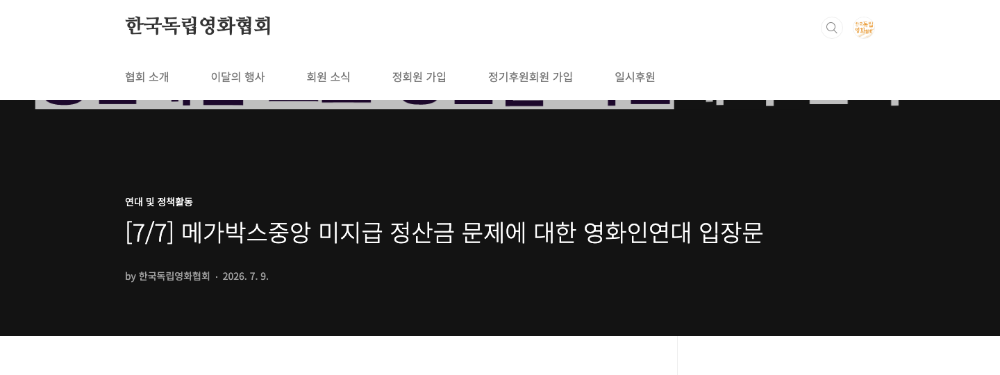</a></td>
    <td width="50%"><a href="https://www.yna.co.kr/view/AKR20260717054700005">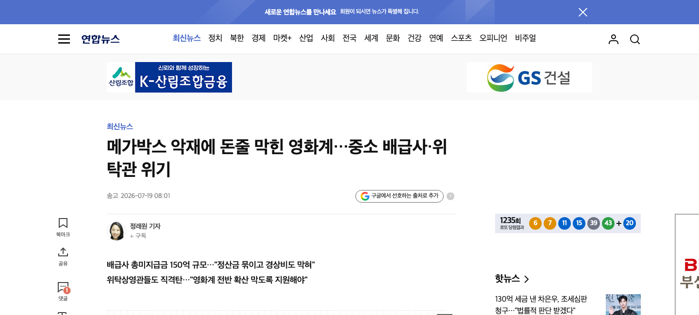</a></td>
  </tr>
  <tr>
    <td align="center"><sub>Korea Independent Film Association · July 9, 2026</sub></td>
    <td align="center"><sub>Yonhap News · July 19, 2026</sub></td>
  </tr>
</table>

The core problem is not merely a lack of visible sales data. Money already paid by the
audience and owed to rightsholders is not segregated from an intermediary's operating
funds. The financial risk of one company can therefore spread across the cash flow of the
entire film ecosystem.

### What Comes After KOBIS

[KOBIS, the Korean Film Council's integrated box-office system](https://www.kobis.or.kr/kobis/business/main/main.do),
collects nationwide ticketing information and improves the transparency of box-office
sales and industry statistics. It does not, however, interpret each film's contract,
isolate rightsholder funds, or execute payment.

In July 2026, we sent the same written questions to Cinecube and Seoul Art Cinema. Both
could export ticketing data to Excel, but their KOBIS transmission timing differed: one
used an early-morning batch on the following day, while the other transmitted
automatically in real time. Cinecube also explained that eligible-sales rules can vary
with theater discount and coupon policies and that film-specific agreements may exist.

| Field observation                                      | MovieEscrow design response                                             |
| ------------------------------------------------------ | ----------------------------------------------------------------------- |
| KOBIS transmission may be next-day batch or real time  | Use theater ledgers as primary input and KOBIS for later reconciliation |
| Eligible-sales rules vary with discounts and coupons   | Version and jointly approve a film-specific `SettlementRule`            |
| Excel export exists; API availability needs validation | Normalize Excel and API inputs through a shared `TicketEvent` adapter   |

This was qualitative product discovery, not a statistical sample of the entire market.
Respondent names, email addresses, and raw reply screenshots are not published.
[Two-theater field research summary](docs/research/FIELD_RESEARCH_SUMMARY_2026-07.md)

```text
KOBIS
→ records and aggregates how much was sold

MovieEscrow
→ confirms which contract rules apply
→ calculates deductions and each rightsholder's share
→ segregates funds
→ pays valid amounts
→ holds only anomalous amounts
```

> **If KOBIS is the data infrastructure that shows film revenue being generated,
> MovieEscrow is the execution infrastructure that connects that data to approved
> contract rules and actual fund flows—determining, segregating, and paying each
> rightsholder's share.**

---

## Problem

| Stakeholder                       | Current pain point                                                                                  |
| --------------------------------- | --------------------------------------------------------------------------------------------------- |
| Theater / exhibitor               | Revenue and settlement funds are mixed with operating capital, and manual settlement is burdensome. |
| Distributor / producer / investor | It is difficult to see when, how, and under which rule an amount was calculated.                    |
| Settlement operator               | Contract interpretation, deductions, ticket/refund reconciliation, and payment are fragmented.      |
| All rightsholders                 | One anomaly can stop even the valid portion of an entire settlement.                                |

The central problem is not simply that calculation is slow. **Rightsholder funds are not
protected from the moment of payment**, and third parties cannot immediately verify the
basis for calculation and execution.

---

## Solution — Keep Valid Funds Moving

| Problem                                             | MovieEscrow design response                                                           |
| --------------------------------------------------- | ------------------------------------------------------------------------------------- |
| Rightsholder funds mix with intermediary capital    | Route payment directly into a film-specific PDA Vault                                 |
| Contract interpretation and calculations are opaque | Gemini extraction → dual approval → immutable rule hash and version                   |
| One anomaly stops the entire settlement             | Continue valid allocation while isolating only the affected screening and amount      |
| Calculation, payment, and evidence are fragmented   | Connect Agent decisions, Anchor execution, and Explorer transactions in one dashboard |

### Execution flow

1. Gemini extracts revenue shares, fees, minimum guarantees, deductions, and settlement
   dates together with the supporting clauses.
2. The distributor and exhibitor review and approve the extracted terms.
3. After both approvals, a Phantom signature calls `init_escrow`, registering the
   contract hash, rule hash, version, and film-specific Vault on Solana.
4. Ticket payments flow directly into the film escrow Vault, which has no private key.
5. The settlement agent checks refund rates, complimentary tickets, and seat overflow
   against screening-level inputs, theater history, and on-chain state.
6. Valid screenings are allocated under the approved waterfall; only anomalous amounts
   are held.
7. The dashboard exposes status, balances, transactions, and the agent's reasoning.

> **Key differentiator — partial hold:** if only 50 out of 1,000 is anomalous, settlement
> of the valid 950 continues while only 50 is isolated. One issue does not stop the entire
> settlement.

---

## Why Solana?

MovieEscrow did not choose Solana to force crypto onto moviegoers. We chose it to keep
**film-specific contract rules, segregated funds, and execution evidence in one
verifiable state**.

<p align="center">
  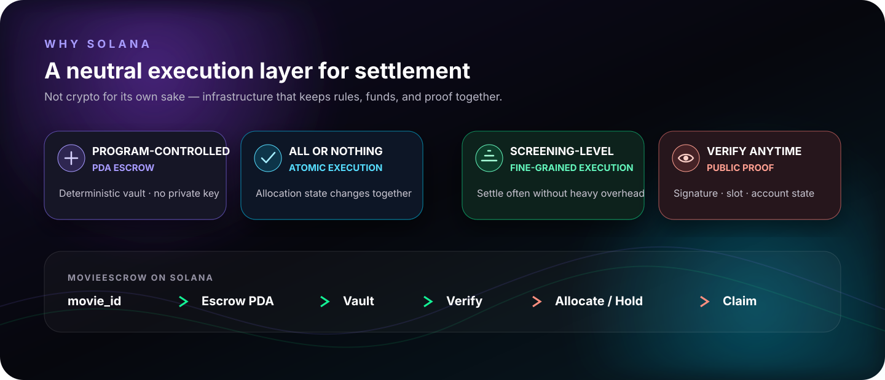
</p>

| Solana capability         | MovieEscrow implementation                                                                   | Settlement impact                                                                       |
| ------------------------- | -------------------------------------------------------------------------------------------- | --------------------------------------------------------------------------------------- |
| PDA without a private key | Film Escrow and role Allocation PDAs are derived deterministically from `movie_id`.          | Neither the theater nor the distributor can withdraw Vault funds at its own discretion. |
| Program-enforced rules    | `deposit`, `settle_batch`, `mark_disputed`, and `claim` pass through Anchor constraints.     | Only state transitions that satisfy approved rules and account constraints can execute. |
| Atomic transactions       | Rightsholder allocation and Escrow state updates are processed in the same execution unit.   | The operation either succeeds as a whole or rolls back without leaving a partial state. |
| Low execution overhead    | Valid settlement and anomalous holds are separate screening- and rightsholder-level calls.   | Small amounts can be processed frequently while only the affected amount is stopped.    |
| Public verifiability      | Signatures, slots, events, and account state connect directly to the dashboard and Explorer. | Every settlement party can inspect the same execution history and current balances.     |

Solana is therefore not a payment decoration. It is MovieEscrow's **neutral settlement
execution layer**. The AI agent proposes an anomaly decision and its evidence; the Solana
program re-checks authority, amount, and state transitions before executing only the
approved scope.

<sub>Technical references: [Program Derived Addresses](https://solana.com/docs/core/pda) · [atomic transaction execution](https://solana.com/docs/intro/quick-start/writing-to-network) · [transaction fee model](https://solana.com/docs/core/fees)</sub>

---

## Key Features

| Feature                | Description                                                                                                |
| ---------------------- | ---------------------------------------------------------------------------------------------------------- |
| Contract → rule        | Gemini extracts settlement terms and evidence; `init_escrow` registers the approved rule hash and version. |
| Segregation at payment | Phantom-signed Devnet USDC enters the film escrow Vault directly instead of mixing with operating funds.   |
| Risk-adjusted checks   | Historical signals adjust thresholds for refunds, complimentary tickets, and seat overflow.                |
| Partial hold           | Only the affected screening and amount become `Disputed`; settlement of valid funds continues.             |
| Withdrawal protection  | Each rightsholder can claim only its own `Claimable` balance; overdraw attempts fail on-chain.             |
| Explainable decisions  | Gemini produces a readable report containing the applied policy, supporting clause, and hold reason.       |
| Transparent dashboard  | The state machine, rightsholder balances, Explorer links, and decision timeline are visible in one place.  |

---

## Product Walkthrough

<table>
  <tr>
    <td width="50%">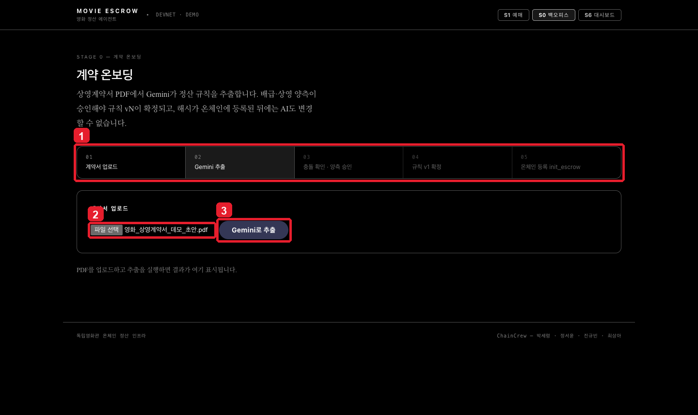</td>
    <td width="50%">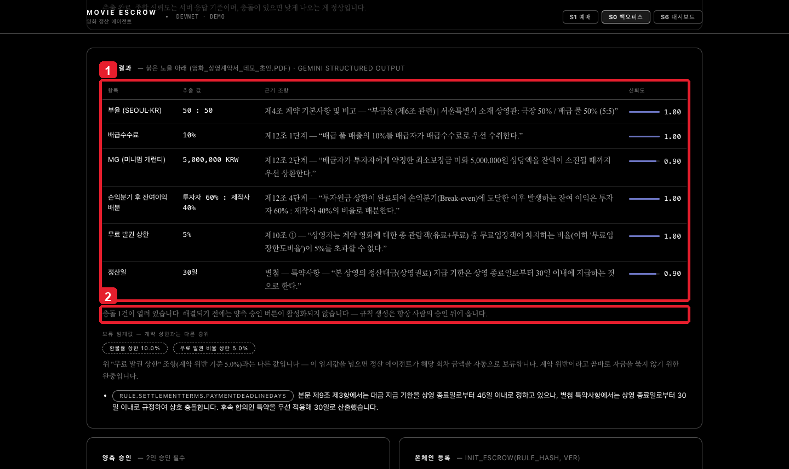</td>
  </tr>
  <tr>
    <td align="center"><strong>1. Upload the contract</strong><br /><sub>Extract settlement rules and supporting clauses from the exhibition agreement.</sub></td>
    <td align="center"><strong>2. Review conflicts and approve</strong><br /><sub>Conflicts block approval; only mutually confirmed rules are finalized.</sub></td>
  </tr>
  <tr>
    <td width="50%">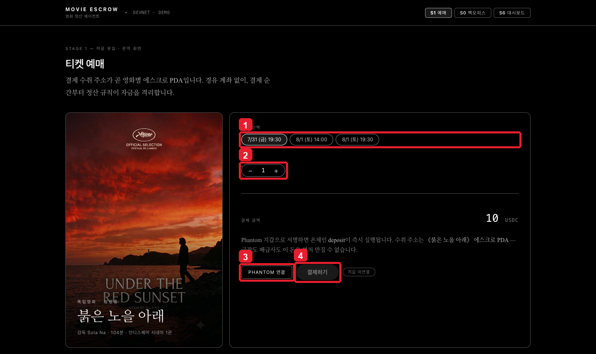</td>
    <td width="50%">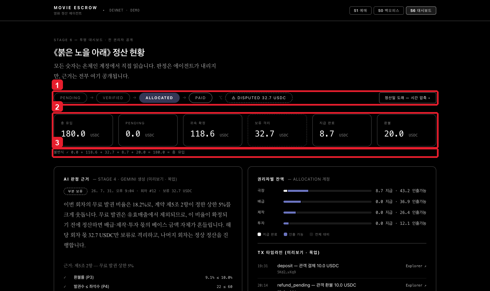</td>
  </tr>
  <tr>
    <td align="center"><strong>3. Pay and segregate</strong><br /><sub>Ticket revenue enters the film-specific Escrow Vault directly.</sub></td>
    <td align="center"><strong>4. Settle with partial holds</strong><br /><sub>View valid funds, held funds, and rightsholder balances together.</sub></td>
  </tr>
  <tr>
    <td width="50%">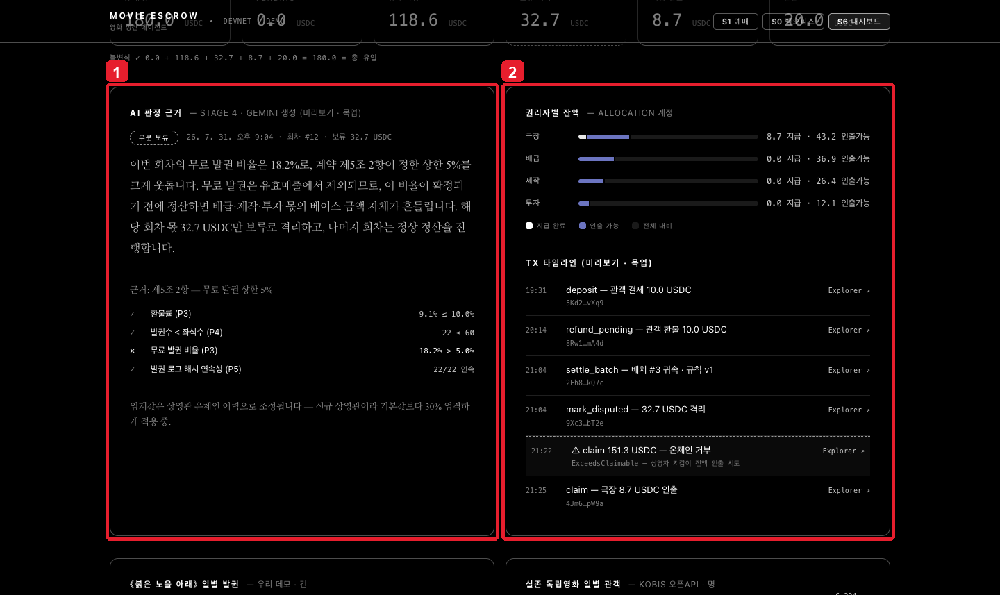</td>
    <td width="50%">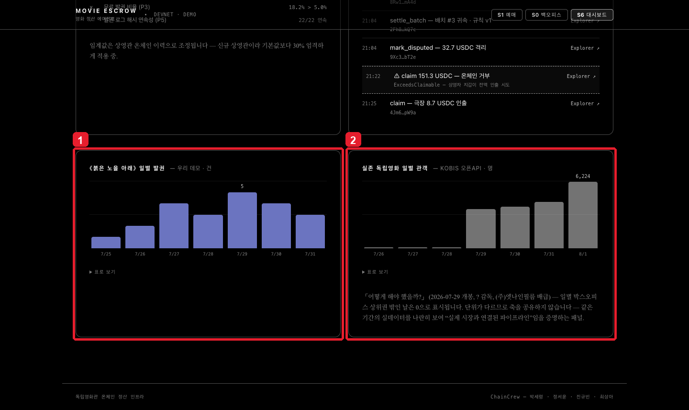</td>
  </tr>
  <tr>
    <td align="center"><strong>5. Explain every decision</strong><br /><sub>Review the applied policy and evidence behind anomaly detection.</sub></td>
    <td align="center"><strong>6. Reconcile and verify</strong><br /><sub>Compare KOBIS information and Explorer records in one view.</sub></td>
  </tr>
</table>

---

## Settlement Flow

### 1. Contract Approval and Fund Segregation

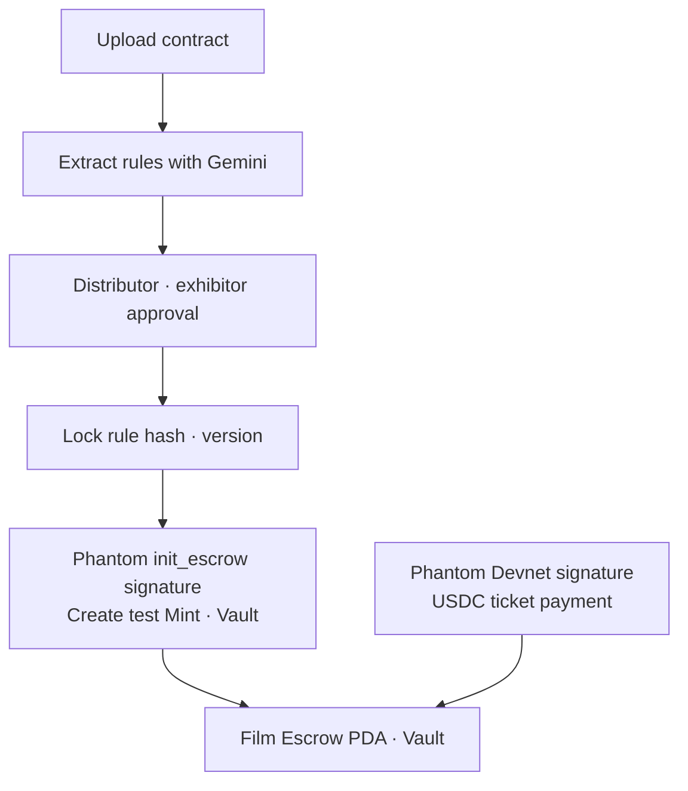

### 2. Verification and Partial-Hold Settlement

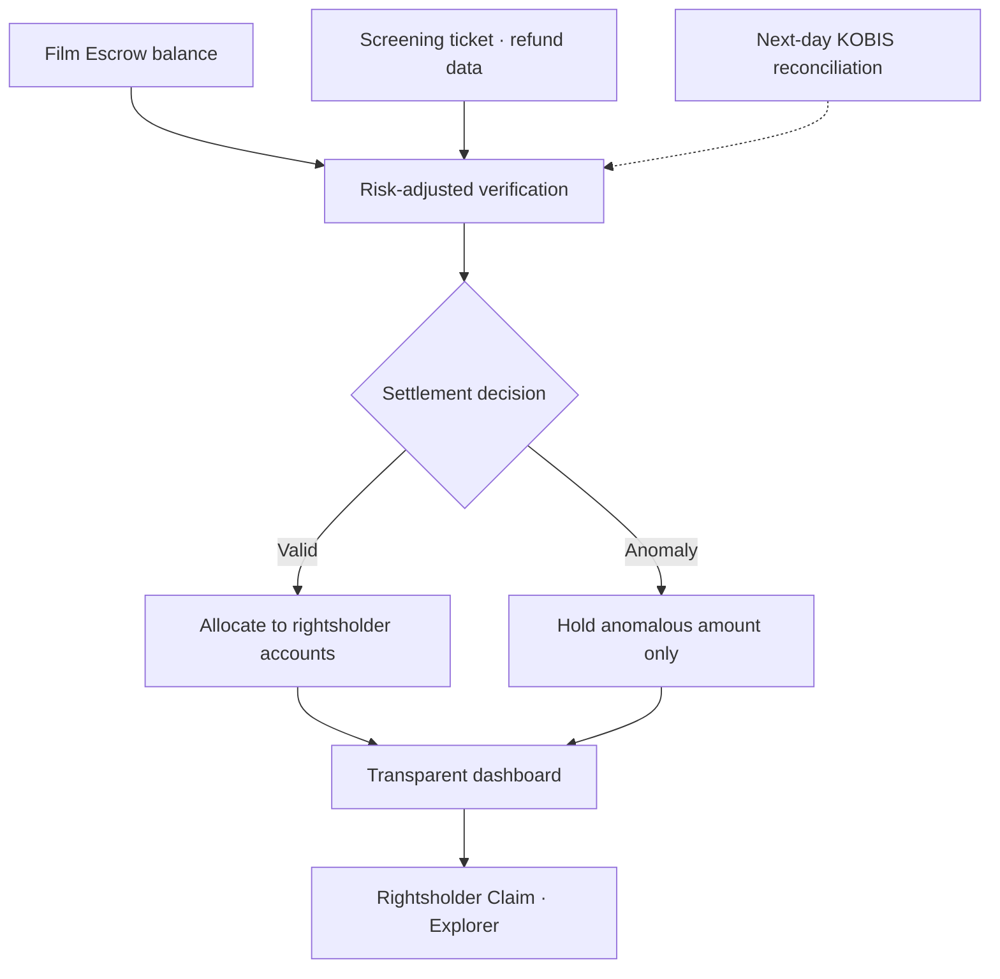

---

## System Architecture

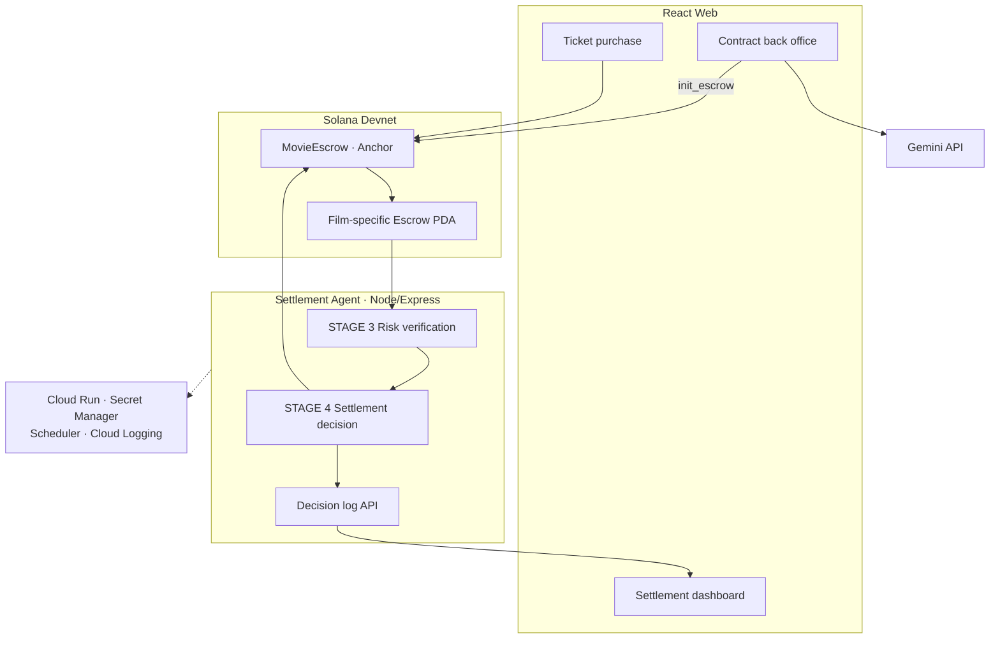

| Service          | Responsibility                                               | Main connections                              |
| ---------------- | ------------------------------------------------------------ | --------------------------------------------- |
| React Web        | Contract approval, ticket purchase, settlement visualization | Gemini, Agent API, Solana                     |
| Settlement Agent | History lookup, validation, decision, chain execution        | Solana RPC, Gemini, Dashboard                 |
| MovieEscrow      | Segregation, allocation, partial hold, withdrawal protection | Solana Devnet                                 |
| Google Cloud     | Web and Agent deployment, authenticated scheduling, secrets  | Cloud Run, Secret Manager, Scheduler, Logging |

---

## Live Demo

The submission build is available directly on Google Cloud Run.

> **[Open the MovieEscrow Live Demo](https://chaincrew-web-612802760361.asia-northeast3.run.app)**

Judge credentials are delivered separately through the hackathon submission channel.

<details>
<summary><strong>Local Development · Docker</strong></summary>

### Prerequisites

Docker Desktop or Docker Engine with the Compose plugin is required. Add the Gemini and
KOBIS API keys to `.env` when testing those integrations directly.

```bash
git clone https://github.com/chaincrew-kr/blockchain-hackathon.git
cd blockchain-hackathon
cp .env.example .env
docker compose up --build
```

| Service          | Address                        |
| ---------------- | ------------------------------ |
| MovieEscrow Web  | `http://localhost:4020`        |
| Settlement Agent | `http://localhost:4030/health` |

Run `docker compose down` to stop the stack. The default configuration is a local
development environment that demonstrates the product flow without a signing key.

#### Run without Docker

```bash
npm install
npm run dev:agent
npm run dev:web
```

Run the complete validation suite with `npm run check`.

</details>

---

## Repository Structure

```text
blockchain-hackathon/
├── apps/
│   ├── web/                 # Purchase · contract back office · dashboard
│   └── agent/               # Risk checks · settlement decisions · log API
├── packages/
│   ├── ai-data/             # Gemini explanations · KOBIS client
│   └── schema/              # Shared TypeScript interfaces · Anchor IDL
├── programs/
│   └── movie_escrow/        # Anchor escrow program
├── tools/
│   ├── devnet-seed/         # Co-signed init · test mint · Escrow seeding
│   └── wallet/              # Localnet · Devnet wallet tools
├── scripts/
│   └── demo-claim.ts        # Claim · overdraw · dispute-resolution rehearsal
├── docs/                    # Submission report · user manual · field research
├── assets/                  # Brand · README · report images
├── Anchor.toml
├── Cargo.toml
└── package.json
```

---

## Tech Stack

<div align="center">

<strong>Frontend &amp; Wallet</strong><br />


<br /><br />

<strong>Agent &amp; AI</strong><br />


<br /><br />

<strong>On-chain Settlement</strong><br />


<br /><br />

<strong>Google Cloud</strong><br />


<br /><br />

<strong>Quality</strong><br />


</div>

---

## Verified on Devnet

The following flows were verified in the August 3, 2026 submission build.

| Verification area   | Result                                                                                     |
| ------------------- | ------------------------------------------------------------------------------------------ |
| Contract onboarding | PDF upload, Gemini extraction, conflict detection, dual approval, `init_escrow` connection |
| Ticket purchase     | Devnet USDC `deposit` through Phantom Wallet Adapter                                       |
| On-chain settlement | Program deployment, two real `settle_batch` and four `mark_disputed` records               |
| Dispute and claim   | Valid Claim, overdraw rejection, blocked Claim during dispute, Claim after resolution      |
| Settlement Agent    | Risk checks, valid/partial-hold decisions, Anchor execution, decision log API              |
| Cloud deployment    | Web and Agent on Cloud Run, Secret Manager, authenticated Scheduler, Cloud Logging         |
| Automated checks    | Agent 42, AI Data 4, Devnet Seed 3 — 49 tests passed                                       |

---

## Team

|                                                      Kyubin Jin                                                      |                                                     Seoyoon Jung                                                     |                                                  Sanga Choi                                                  |                                                     Seryeong Park                                                     |
| :------------------------------------------------------------------------------------------------------------------: | :------------------------------------------------------------------------------------------------------------------: | :----------------------------------------------------------------------------------------------------------: | :-------------------------------------------------------------------------------------------------------------------: |
| <a href="https://github.com/kyubinjin"></a> | <a href="https://github.com/youn1205"></a> | <a href="https://github.com/jj8ng"></a> | <a href="https://github.com/ryeong03"></a> |
|                                              **A · Frontend / AI Data**                                              |                                              **B · Chain / Fund Flow**                                               |                                      **C · Chain / Decision Execution**                                      |                                            **D · Agent / Decision Logic**                                             |
|                            Contract onboarding · purchase<br />Dashboard · Gemini prompts                            |                               Escrow initialization · deposit<br />Refund · settlement                               |                           Claim protection · partial hold<br />Dispute resolution                            |                           Risk checks · settlement decisions<br />Express API · deployment                            |
|                                      [@kyubinjin](https://github.com/kyubinjin)                                      |                                       [@youn1205](https://github.com/youn1205)                                       |                                      [@jj8ng](https://github.com/jj8ng)                                      |                                       [@ryeong03](https://github.com/ryeong03)                                        |

---

## License

This project is distributed under the [MIT License](LICENSE).

<br />

<div align="center">


**Google Cloud × Solana AI Agentic Commerce Hackathon**

_Team ChainCrew — Kyubin Jin · Seoyoon Jung · Sanga Choi · Seryeong Park_

</div>
