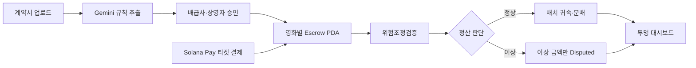
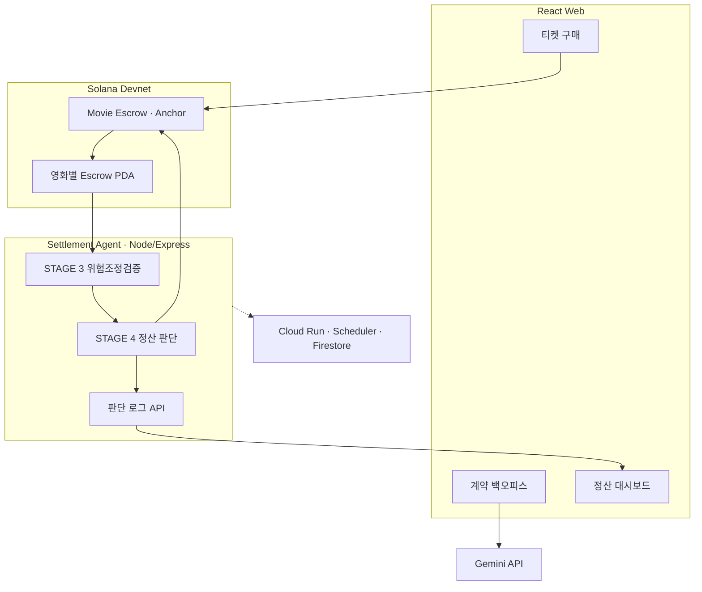

<h1 align="center">AI 영화 정산 에이전트</h1>

<div align="center">
  <p><strong>독립영화 티켓 매출을 결제 순간부터 지키는 온체인 정산 인프라</strong></p>
  <p>계약 규칙과 발권 기록을 AI 에이전트가 검증하고, 정상 금액은 자동 정산하며 이상 금액만 보류합니다.</p>
  <p>
    <a href="docs/PRODUCT_BRIEF.md">Product Brief</a> ·
    <a href="docs/indie_cinema_requirements.html">Requirements</a> ·
    <a href="docs/indie_cinema_product_spec.html">Product Spec</a> ·
    <a href="docs/최종 실행계획서.html">Execution Plan</a>
  </p>
</div>

<br />

## Contents

- [Overview](#-overview)
- [Product Highlights](#-product-highlights)
- [Settlement Flow](#-settlement-flow)
- [System Architecture](#-system-architecture)
- [빠른 시작](#-빠른-시작)
- [프로젝트 구조](#-프로젝트-구조)
- [기술 스택](#-기술-스택)
- [개발 현황](#-개발-현황)
- [협업 규칙](#-협업-규칙)
- [Team](#-team)

## 🧭 Overview

영화 티켓 매출은 극장 운영사나 예매 사업자에게 먼저 모인 뒤 권리자에게 사후
정산됩니다. 중간 사업자에게 유동성 문제가 발생하면 이미 판매된 표의 배급사,
제작사와 투자자 몫까지 운영자금과 함께 묶일 수 있습니다.

이 프로젝트는 티켓 결제금을 영화별 Solana 에스크로 PDA에 직접 격리합니다. AI
에이전트는 사람이 승인한 계약 규칙과 온체인 발권·환불 기록을 검증하고, 정상
금액은 지급하며 이상 금액만 `Disputed` 상태로 보류합니다.

> **설계 원칙:** AI는 돈을 임의로 나누지 않습니다. 분배는 사람이 승인한
> 결정론적 규칙이 실행하고, AI는 계약 해석과 집행 전 검증·이상 탐지를 담당합니다.

| 해결하려는 문제                  | 제품 접근 방식                                                |
| -------------------------------- | ------------------------------------------------------------- |
| 티켓 매출과 극장 운영자금의 혼재 | 결제금을 개인키 없는 영화별 에스크로 PDA에 직접 격리          |
| 계약 해석과 정산 계산의 수작업   | Gemini가 계약 조항을 구조화하고 양측 승인 후 규칙 버전을 고정 |
| 발권·환불 기록의 불일치          | 온체인 이력 기반 위험조정검증과 해시 연속성 검사              |
| 이상 한 건으로 전체 정산 중단    | 정상 금액은 지급하고 이상 금액만 부분 보류                    |
| 지급 근거 확인의 어려움          | 규칙 버전, 트랜잭션과 자연어 판단 근거를 대시보드에 공개      |

## ✨ Product Highlights

| 기능          | 설명                                                                              |
| ------------- | --------------------------------------------------------------------------------- |
| 계약 → 규칙   | Gemini Structured Output으로 부율·수수료·MG·공제·정산일과 근거 조항을 추출합니다. |
| 자금 격리     | Solana Pay 결제금이 영화별 에스크로 PDA로 직접 들어갑니다.                        |
| 위험조정검증  | 환불률, 무료 발권, 좌석 초과와 이벤트 해시 연속성을 검사합니다.                   |
| 부분 보류     | 문제가 있는 회차·금액만 격리하고 정상 정산은 중단하지 않습니다.                   |
| 인출 제한     | 각 권리자는 자기 `Claimable` 잔액까지만 인출할 수 있습니다.                       |
| 투명 대시보드 | 상태, 권리자별 잔액, 트랜잭션과 AI 판단 근거를 공개합니다.                        |

## 🔄 Settlement Flow



Phase 1은 외부 유료 데이터 없이 온체인 이력만으로 완결합니다. Phase 2에서는 신규
상영관이나 환불 불일치가 발생했을 때만 에이전트가 x402/pay.sh로 신뢰도·증빙
데이터를 조건부 구매합니다.

## 🏗 System Architecture



## 🚀 빠른 시작

### 사전 준비

| 영역        | 필요 환경                     |
| ----------- | ----------------------------- |
| Web · Agent | Node.js 22.10+, npm 10+       |
| Blockchain  | Rust, Anchor 0.31, Solana CLI |
| AI          | Gemini API Key                |
| Network     | Solana Localnet 또는 Devnet   |

```bash
git clone https://github.com/chaincrew-kr/blockchain-hackathon.git
cd blockchain-hackathon
npm install
cp .env.example .env
```

| 서비스           | 실행 명령           | 기본 주소                        |
| ---------------- | ------------------- | -------------------------------- |
| Web              | `npm run dev:web`   | `http://localhost:4020`          |
| Settlement Agent | `npm run dev:agent` | `http://localhost:4030/health`   |
| 전체 검사        | `npm run check`     | lint · typecheck · test · format |

개발용 에이전트는 Gemini와 실제 Anchor 연결 전에도 fixture/stub으로 실행할 수
있습니다.

## 📁 프로젝트 구조

```text
blockchain-hackathon/
├── apps/
│   ├── web/                 # [A] 구매 웹 · 계약 백오피스 · 대시보드
│   └── agent/               # [D] 위험조정검증 · 정산 판단 · 로그 API
├── packages/
│   └── schema/              # 팀 공용 TypeScript 인터페이스 · IDL
├── programs/
│   └── movie_escrow/        # [B·C] Anchor 에스크로 프로그램
├── tools/
│   └── wallet/              # Localnet·Devnet 지갑 도구
├── docs/                    # 요구사항 · 스펙 · 실행계획 · 작업 문서
├── legacy/                  # Phase 2용 x402 결제 PoC
├── Anchor.toml
├── Cargo.toml
└── package.json
```

## 🛠 기술 스택

| 영역          | 기술                                                      |
| ------------- | --------------------------------------------------------- |
| Frontend      | React 19 · TypeScript · Vite                              |
| Agent Backend | Node.js · Express 5 · TypeScript                          |
| AI            | Gemini Structured Output                                  |
| Blockchain    | Solana · Anchor 0.31 · Rust · PDA                         |
| Payment       | Solana Pay · Devnet USDC                                  |
| Cloud         | Google Cloud Run · Scheduler · Firestore · Secret Manager |
| Testing       | Vitest · TypeScript · ESLint · Prettier                   |
| Phase 2       | x402 · pay.sh                                             |

## 📌 개발 현황

### 구현 완료

- STAGE 3 검증 4종과 신규 상영관 임계값 조정
- STAGE 4 진행·부분 보류 판정과 보류액 계산
- 템플릿 기반 자연어 판정 리포트
- 배치 트리거·스냅샷·발권 로그 API
- fixture/stub 기반 정산 파이프라인
- D 파트 타입 검사와 테스트 13개

### 연결 예정

- 실제 Solana RPC 과거 이력 조회
- B·C Anchor 프로그램의 `settle_batch`·`mark_disputed` 호출
- Gemini 자연어 판단 리포트
- A 대시보드와 라이브 API 연결
- Firestore·Cloud Run·Scheduler·Secret Manager

자세한 D 파트 진행 상황은 [D 작업 체크리스트](docs/ponyo_work/README.md)에서
확인할 수 있습니다.

## 🌿 협업 규칙

```text
feature/* → dev → main
```

- 모든 기능은 `feature/*` 브랜치에서 개발하고 PR로 `dev`에 통합합니다.
- `packages/schema` 변경은 전원 리뷰가 필요합니다.
- 지갑·개인키·API 키는 Git에 커밋하지 않습니다.
- 지갑·정산 코드 PR은 B·C 중 한 명이 추가 확인합니다.
- D의 판정 파이프라인은 B·C의 Anchor IDL과 A의 대시보드 API 계약을 함께
  확인합니다.

자세한 내용은 [Git 운영 가이드](docs/team/GIT_WORKFLOW.md)를 참고하세요.

## 👥 Team

|  |  |  |  |
| :-----------------------------------------------------------------------------------: | :----------------------------------------------------------------------------------: | :-------------------------------------------------------------------------------: | :----------------------------------------------------------------------------------: |
|                                      **진규빈**                                       |                                      **정서윤**                                      |                                    **최상아**                                     |                                      **박세령**                                      |
|                              **A · Frontend / AI Data**                               |                              **B · Chain / Fund Flow**                               |                        **C · Chain / Decision Execution**                         |                            **D · Agent / Decision Logic**                            |
|                 계약 온보딩<br>구매 웹<br>대시보드<br>Gemini 프롬프트                 |                    에스크로 초기화<br>입금·환불<br>배치 귀속·정산                    |                        인출 제한<br>부분 보류<br>분쟁 해결                        |                    위험조정검증<br>정산 판단<br>Express API·배포                     |
|                      [@kyubinjin](https://github.com/kyubinjin)                       |                       [@youn1205](https://github.com/youn1205)                       |                        [@jj8ng](https://github.com/jj8ng)                         |                       [@ryeong03](https://github.com/ryeong03)                       |

<br />

<div align="center">
  <sub>Google Cloud × Solana AI Agentic Commerce Hackathon · Team ChainCrew</sub>
</div>
