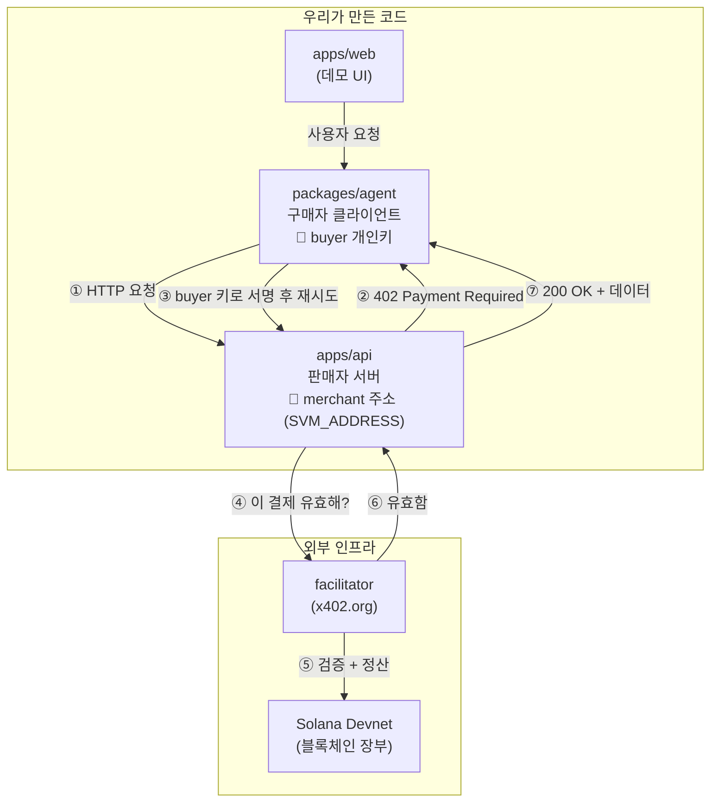

# blockchain-hackathon

> **해커톤 주제 — AI 에이전트가 매 단계 사람 승인 없이, 정해진 한도 안에서 스스로
> 결제를 처리하는 프로덕트.** (Google Cloud × Solana, 단일 트랙: Solana 기반
> Agentic Commerce · [대회 개요·제출 요건](docs/team/HACKATHON.md))

이 저장소는 그중 **"사람 승인 없는 자동 결제" 레일**을 Solana Devnet + x402 v2로
구현한 것입니다. 결제 증명이 없는 요청에는 `402 Payment Required`를 반환하고,
에이전트는 USDC 결제를 서명한 뒤 요청을 자동 재시도합니다. 나머지 요소(지출 한도·
정책, 그 위에 얹을 프로덕트)는 진행 중입니다 — [구현 현황](docs/onboarding/STATUS.md)
참고.

> **블록체인·x402가 처음이신가요?** 개념부터 이해하려면 [개념 온보딩](docs/onboarding/CONCEPTS.md),
> 팀 공용 devnet 지갑으로 바로 테스트하려면 [팀 Devnet 셋업](docs/onboarding/TEAM_DEVNET_SETUP.md),
> 지금 뭐가 되고 안 되는지는 [구현 현황](docs/onboarding/STATUS.md)을 보세요.

## 아키텍처



**buyer와 merchant 구분:** 둘은 서로 다른 지갑이며, 코드에서 읽는 값으로 나뉩니다.
구매자 클라이언트(`packages/agent`)는 **buyer 개인키**(`SVM_KEYPAIR_PATH` /
`SVM_PRIVATE_KEY`)로 결제를 서명하고, 판매자 서버(`apps/api`)는 **merchant 공개
주소**(`SVM_ADDRESS`)만 알고 "여기로 결제하라"고 알려줍니다. 서버에는 개인키가 없어,
서버가 노출돼도 지갑은 안전합니다.

MVP는 요청당 결제인 x402 `exact` 방식입니다. 장기 구독이나 반복 pull-payment가 제품
요구사항에 들어올 때만 `@solana/subscriptions`를 별도 실험 브랜치에서 검토합니다.

## 저장소 구조

```text
apps/
├── api/          # Express + x402 유료 API — 판매자 서버 (Backend/Cloud)
└── web/          # 데모 UI 작업 공간 (Frontend/Product)
packages/
├── agent/        # 402 처리, 지불 클라이언트 — 구매자 (AI)
└── blockchain/   # 지갑, 정산, 공용 온체인 코드 (Blockchain)
docs/
├── onboarding/   # 개념·셋업·현황 (새 팀원용)
├── team/         # Git 규칙, 팀 계획, 해커톤 개요
└── PRODUCT_BRIEF.md # 제품 요약
config/           # ESLint, TypeScript 공통 설정
infra/            # Docker Compose
```

세부 역할과 일정은 [4인 팀 계획](docs/team/TEAM_PLAN.md)을 참고하세요.

## 빠른 시작

Node.js 22.10 이상이 필요합니다. Windows PowerShell의 실행 정책 오류가 나면
`npm` 대신 `npm.cmd`를 사용하세요.

```bash
npm install
cp .env.example .env   # SVM_ADDRESS를 판매자 공개 주소로 변경
npm run dev            # http://localhost:4021
```

다른 터미널에서 402 챌린지를 확인하고, 구매자 키를 설정한 뒤 실제 결제까지
실행합니다.

```bash
npm run inspect:402    # HTTP 402 + payment-required 헤더 확인
npm run client         # 결제 실행 → 200 OK + 정산 결과
```

구매자 키·faucet 준비는 [팀 Devnet 셋업](docs/onboarding/TEAM_DEVNET_SETUP.md),
Devnet 개념과 신청 목록은 [Devnet 가이드](docs/onboarding/DEVNET.md)를 따르세요.
Docker 실행은 셋업 문서의 [Docker 섹션](docs/onboarding/TEAM_DEVNET_SETUP.md#docker-실행),
코드 없이 결제를 감싸는 `pay.sh`는 [개념 문서 11번](docs/onboarding/CONCEPTS.md#11-paysh는-뭐야-왜-간단한가)을
참고하세요.

## 주요 명령

| 명령                  | 용도                               |
| --------------------- | ---------------------------------- |
| `npm run dev`         | API 개발 서버                      |
| `npm run inspect:402` | 결제 전 402 챌린지 확인            |
| `npm run client`      | Devnet 결제 클라이언트 실행        |
| `npm run check`       | lint, 타입, 테스트, 포맷 전체 검사 |
| `npm run docker:up`   | Docker Compose 빌드/실행           |

## 팀 Git 규칙

`feature/* → dev → main`만 허용합니다. `main`과 `dev`에 직접 push하지 않습니다.
[Git 브랜치 운영](docs/team/GIT_WORKFLOW.md)을 따릅니다.

## 참고 자료

- [x402](https://x402.org/)
- [x402 판매자 빠른 시작](https://docs.cdp.coinbase.com/x402/quickstart-for-sellers)
- [x402 구매자 빠른 시작](https://docs.cdp.coinbase.com/x402/quickstart-for-buyers)
- [Solana Subscriptions](https://github.com/solana-foundation/subscriptions)
- [pay.sh 문서](https://pay.sh/docs)
