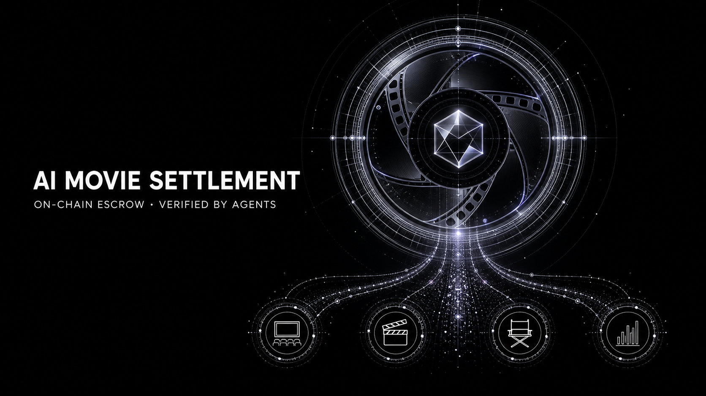
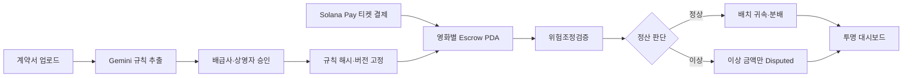
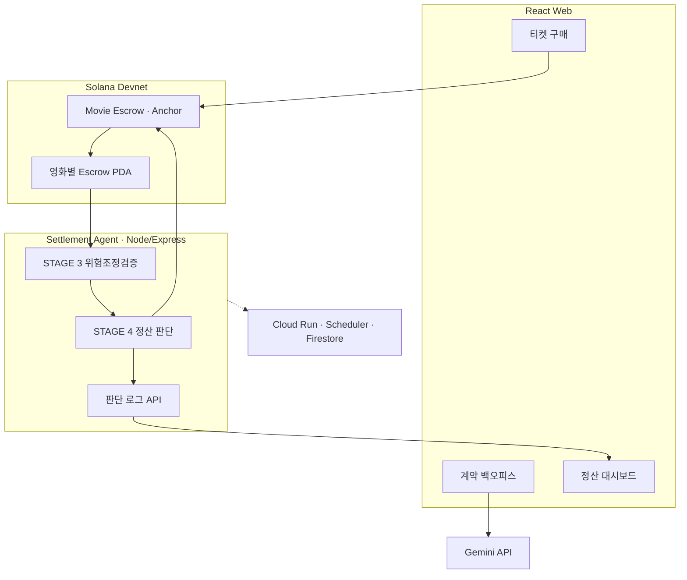
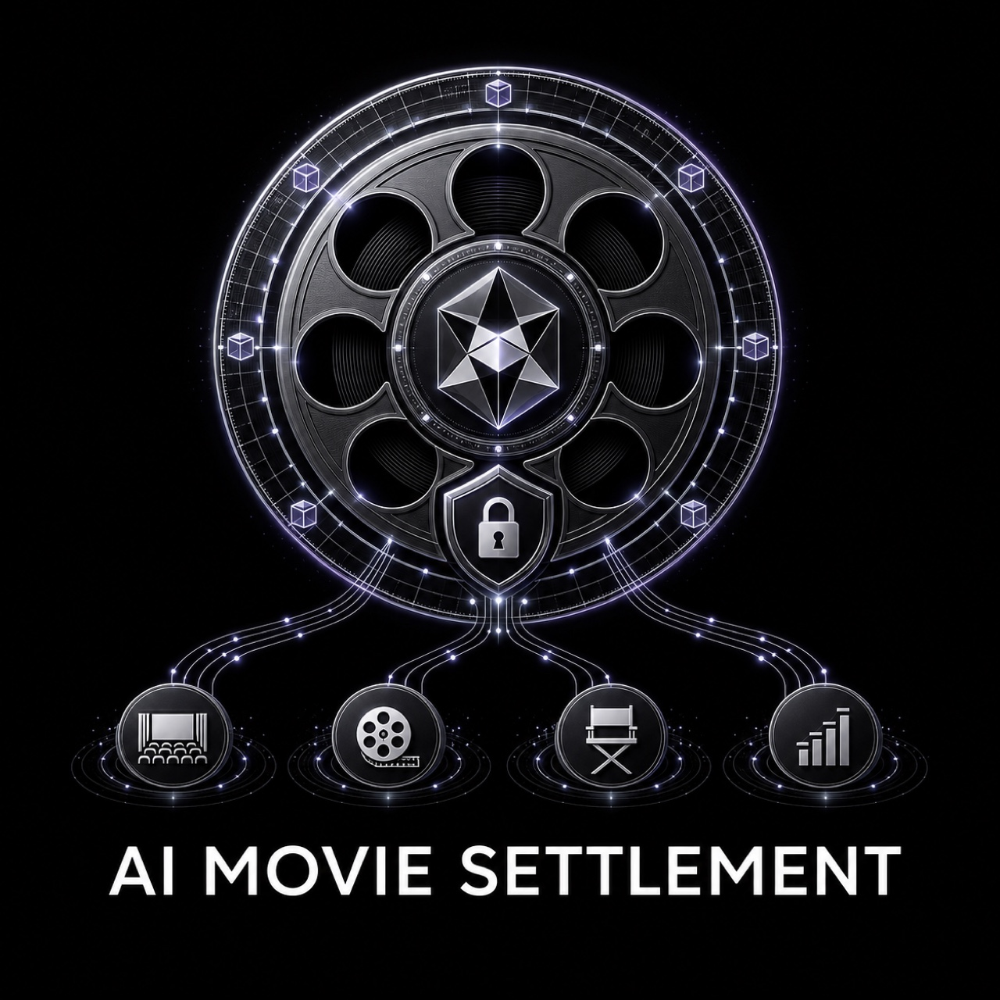

<div align="center">



<h1>AI Movie Settlement</h1>

**AI-Powered On-Chain Settlement Infrastructure for Independent Cinema**

_독립영화 티켓 매출을 결제 순간부터 에스크로에 격리하고, AI 에이전트가 계약
규칙과 발권 기록을 검증해 정상 금액은 자동 정산하며 이상 금액만 보류합니다._

<br />

[](docs/PRODUCT_BRIEF.md)
[](docs/indie_cinema_requirements.html)
[](docs/indie_cinema_product_spec.html)
[](docs/최종%20실행계획서.html)

<br />


<br />

<em>AI는 돈을 임의로 나누지 않습니다. 사람이 승인한 결정론적 규칙이 분배를
실행하고, AI는 계약 해석과 집행 전 검증·이상 탐지를 담당합니다.</em>

</div>

---

## Overview

국내 영화 티켓 매출은 극장 운영사나 예매 사업자에게 먼저 집중된 뒤 배급사,
제작사와 투자자에게 사후 정산됩니다. 중간 사업자에게 유동성 문제나 회생·파산이
발생하면 이미 판매된 표의 권리자 몫까지 운영자금과 함께 묶일 수 있습니다.

**AI Movie Settlement**는 티켓 결제금을 영화별 Solana 에스크로 PDA로 직접
유입시켜 사업자의 자금과 분리합니다. AI 에이전트는 사람이 승인한 계약 규칙과
온체인 발권·환불 기록을 검증하고, 정상 금액은 지급하며 문제가 있는 회차·금액만
`Disputed` 상태로 격리합니다.

초기 대상은 새로운 결제·정산 레일을 빠르게 적용할 수 있는 **독립·예술영화
전용관, 영화제와 공동체 상영 조직**입니다. 관객용 암호화폐 서비스가 아니라,
관객 결제 뒤에서 작동하는 **B2B 정산 인프라**입니다.

---

## Why We Built This

2026년 메가박스중앙의 회생절차 과정에서 제작·수입·배급사와 위탁상영 사업자의
미지급 정산금 문제가 현실화됐습니다. 영화인연대는 이 정산채권이 영화산업의
제작·배급·상영 순환을 구성한다는 점을 강조하며 중소 사업자 보호와 정산금 분리
관리를 요구했습니다. 이후 보도에서는 배급사 미지급금이 약 150억 원, 전국 70여
개 위탁상영관의 미정산액이 약 70억~80억 원으로 추정됐습니다.

- [영화인연대 — 메가박스중앙 미지급 정산금 문제에 대한 입장문](https://kifv.org/725)
- [연합뉴스 — 메가박스 악재에 돈줄 막힌 영화계](https://www.yna.co.kr/view/AKR20260717054700005)

이 사례가 보여준 문제는 “매출 데이터가 보이지 않는다”는 것만이 아닙니다. 관객이
이미 낸 돈 가운데 권리자에게 돌아가야 할 몫이 중간 사업자의 운영자금과 분리되지
않아, 한 사업자의 재무 위험이 영화 생태계 전체의 현금흐름으로 전파된다는
점입니다.

### KOBIS 다음에 필요한 것

[KOBIS 영화관입장권통합전산망](https://www.kobis.or.kr/kobis/business/main/main.do)은
전국 영화관의 발권정보를 실시간으로 집계해 매출 데이터와 영화산업 통계의
투명성을 높입니다. 그러나 영화별 계약을 해석하거나 권리자별 금액을 격리하고 실제
지급을 실행하는 시스템은 아닙니다.

현장 운영의 전송 시점은 극장·발권 솔루션에 따라 다를 수 있습니다. 2026년 7월
씨네큐브 답변에서는 상영일 다음 날 새벽에 발권 솔루션이 일 1회 일괄 전송한다고
확인됐습니다. 따라서 제품은 KOBIS를 결제 직후 정산의 유일한 실시간 원천으로
가정하지 않고, 극장 발권 원장과 솔루션 API를 1차 입력으로 사용하며 KOBIS를 사후
대조 자료로 활용합니다. [현장 조사 정리](docs/research/CINECUBE_FIELD_RESPONSE_2026-07-31.md)

```text
KOBIS
→ 얼마가 판매됐는지 저장·집계

AI Movie Settlement
→ 어떤 계약 규칙을 적용할지 확정
→ 공제와 권리자별 몫 계산
→ 자금 격리
→ 정상 금액 지급
→ 이상 금액만 보류
```

> **KOBIS가 영화별 매출의 발생 사실을 보여주는 데이터 인프라라면, AI Movie
> Settlement는 그 데이터를 승인된 계약 규칙과 실제 자금 흐름에 연결해 권리자의
> 몫을 확정·격리·지급하는 실행 인프라입니다.**

### 현재 데모와 현실 적용의 경계

해커톤에서는 관객 역할 지갑이 Devnet USDC를 영화별 PDA로 직접 보내 자금 격리
메커니즘을 증명합니다. 실제 서비스에서는 관객에게 암호화폐 결제를 요구하는 대신,
기존 원화 결제를 PG·신탁·에스크로 계좌와 연결해 수납 단계부터 정산 대상 자금을
분리해야 합니다. 이 법정화폐 연동과 규제·회계 검토는 현재 MVP 범위 밖이며
상용화 로드맵에 해당합니다.

---

## Problem

| 대상                 | 현재 겪는 문제                                                               |
| -------------------- | ---------------------------------------------------------------------------- |
| 극장·상영자          | 매출과 정산 대상 금액이 운영자금에 섞이고, 수작업 정산 부담이 큽니다.        |
| 배급사·제작사·투자자 | 언제 어떤 규칙으로 얼마가 계산됐는지 실시간으로 확인하기 어렵습니다.         |
| 정산 담당자          | 계약 해석, 공제 계산, 발권·환불 대조와 지급이 분리돼 오류 추적이 어렵습니다. |
| 모든 권리자          | 이상 한 건이 발생하면 정상 금액까지 함께 정산이 중단될 수 있습니다.          |

핵심 문제는 단순히 계산이 느리다는 것이 아닙니다. **돈이 처음부터 권리자별로
보호되지 않고**, 계산과 지급의 근거를 제3자가 즉시 검증하기 어렵다는 구조적
문제입니다.

---

## Solution

1. Gemini가 계약서에서 부율·수수료·MG·공제·정산일을 근거 조항과 함께
   구조화합니다.
2. 배급사와 상영자가 추출 결과를 확인하고 승인합니다.
3. 승인된 규칙의 해시와 버전을 온체인에 고정합니다.
4. 티켓 결제금이 개인키가 없는 영화별 에스크로 PDA로 직접 들어갑니다.
5. 정산 에이전트가 환불률, 무료 발권, 좌석 초과와 해시 연속성을 검증합니다.
6. 정상 회차는 승인된 규칙으로 귀속·분배하고 이상 회차의 금액만 보류합니다.
7. 대시보드에서 상태, 잔액, 트랜잭션과 AI 판단 근거를 확인합니다.

> **핵심 차별점 — 부분 보류:** 1,000 중 50에만 이상이 있다면 950의 정상 정산은
> 계속 진행하고 50만 격리합니다. 문제 하나로 전체 정산을 멈추지 않습니다.

---

## Key Features

| 기능             | 설명                                                                                            |
| ---------------- | ----------------------------------------------------------------------------------------------- |
| 계약 → 규칙      | Gemini Structured Output으로 정산 조건과 근거 조항을 추출하고 양측 승인 후 버전으로 고정합니다. |
| 결제 순간 격리   | Solana Pay 결제금이 영화별 에스크로 PDA에 직접 유입되어 운영자금과 섞이지 않습니다.             |
| 위험조정검증     | 과거 이력에 따라 임계값을 조정하고 환불률·무료 발권·좌석 초과·해시 연속성을 검사합니다.         |
| 부분 보류        | 문제가 있는 회차·금액만 `Disputed`로 격리하고 정상분 지급은 중단하지 않습니다.                  |
| 인출 제한        | 각 권리자는 자기 `Claimable` 잔액까지만 인출할 수 있으며 초과 요청은 온체인에서 거부됩니다.     |
| 설명 가능한 판단 | Gemini가 적용 정책, 근거 조항과 보류 사유를 자연어 리포트로 생성합니다.                         |
| 투명 대시보드    | 상태머신, 권리자별 잔액, Explorer 링크와 판단 로그를 공개합니다.                                |

---

## Settlement Flow



Phase 1은 외부 유료 데이터 없이 온체인 이력만으로 완결합니다. Phase 2에서는 신규
상영관이나 환불 불일치가 발생했을 때만 에이전트가 정책과 예산을 확인한 뒤
x402/pay.sh로 신뢰도·증빙 데이터를 조건부 구매합니다.

---

## System Architecture



| 서비스           | 책임                                              | 주요 연결                       |
| ---------------- | ------------------------------------------------- | ------------------------------- |
| React Web        | 계약 승인, 구매 시연, 정산 결과 시각화            | Gemini, Agent API, Solana       |
| Settlement Agent | 이력 조회, 정합성 검증, 정산 판단, 체인 호출      | Solana RPC, Gemini, Dashboard   |
| Movie Escrow     | 자금 격리, 귀속, 부분 보류, 인출 제한과 분쟁 해결 | Solana Devnet                   |
| Google Cloud     | Agent 배포, 배치 트리거, 로그·비밀값 관리         | Cloud Run, Scheduler, Firestore |

---

## Quick Start

### Prerequisites

| 영역        | 필요 환경                     |
| ----------- | ----------------------------- |
| Web · Agent | Node.js 22.10+, npm 10+       |
| Blockchain  | Rust, Anchor 0.31, Solana CLI |
| AI          | Gemini API Key                |
| Network     | Solana Localnet 또는 Devnet   |

```bash
git clone https://github.com/chaincrew-kr/blockchain-hackathon.git
cd blockchain-hackathon
npm install
cp .env.example .env
```

| 서비스           | 실행 명령           | 기본 주소                        |
| ---------------- | ------------------- | -------------------------------- |
| Web              | `npm run dev:web`   | `http://localhost:4020`          |
| Settlement Agent | `npm run dev:agent` | `http://localhost:4030/health`   |
| 전체 검사        | `npm run check`     | lint · typecheck · test · format |

개발용 정산 에이전트는 Gemini와 실제 Anchor 연결 전에도 fixture/stub으로 실행할 수
있습니다.

---

## Repository Structure

```text
blockchain-hackathon/
├── apps/
│   ├── web/                 # [A] 구매 웹 · 계약 백오피스 · 대시보드
│   └── agent/               # [D] 위험조정검증 · 정산 판단 · 로그 API
├── packages/
│   ├── ai-data/             # [A] Gemini 판정 설명 · KOBIS 클라이언트
│   └── schema/              # 팀 공용 TypeScript 인터페이스 · IDL
├── programs/
│   └── movie_escrow/        # [B·C] Anchor 에스크로 프로그램
├── tools/
│   └── wallet/              # Localnet·Devnet 지갑 도구
├── docs/                    # 요구사항 · 스펙 · 실행계획 · 작업 문서
├── assets/readme/           # README 커버 · 소셜 이미지
├── legacy/                  # Phase 2용 x402 결제 PoC
├── Anchor.toml
├── Cargo.toml
└── package.json
```

Anchor instruction별 B·C 담당은
[`programs/movie_escrow/README.md`](programs/movie_escrow/README.md)의 역할표를
기준으로 합니다.

---

## Tech Stack

| 영역          | 기술                                                      |
| ------------- | --------------------------------------------------------- |
| Frontend      | React 19 · TypeScript · Vite                              |
| Agent Backend | Node.js · Express 5 · TypeScript                          |
| AI            | Gemini Structured Output                                  |
| Blockchain    | Solana · Anchor 0.31 · Rust · PDA                         |
| Payment       | Solana Pay · Devnet USDC                                  |
| Cloud         | Google Cloud Run · Scheduler · Firestore · Secret Manager |
| Testing       | Vitest · TypeScript · ESLint · Prettier                   |
| Phase 2       | x402 · pay.sh                                             |

---

## Development Status

### Implemented

- STAGE 3 검증 4종과 신규 상영관 임계값 조정
- STAGE 4 진행·부분 보류 판정과 보류액 계산
- 템플릿 기반 자연어 판정 리포트
- 배치 트리거·스냅샷·발권 로그 API
- fixture/stub 기반 정산 파이프라인
- D 파트 타입 검사와 테스트 13개

### Integration Pending

- 실제 Solana RPC 과거 이력 조회
- B·C Anchor 프로그램의 `settle_batch`·`mark_disputed` 호출
- Gemini 자연어 판단 리포트
- A 대시보드와 라이브 API 연결
- Firestore·Cloud Run·Scheduler·Secret Manager

자세한 D 파트 진행 상황은 [D 작업 체크리스트](docs/ponyo_work/README.md)에서
확인할 수 있습니다.

화면·에이전트·Anchor 간 필드, 금액 단위, 상태 전이와 변경 절차는
[공통 스키마 계약 관리 가이드](docs/SCHEMA_CONTRACT.md)를 기준으로 관리합니다.

---

## Collaboration

```text
feature/* → dev → main
```

- 모든 기능은 `feature/*` 브랜치에서 개발하고 PR로 `dev`에 통합합니다.
- `packages/schema` 변경은 전원 리뷰가 필요합니다.
- `packages/ai-data`는 A가 소유하고, D는 공개 인터페이스만 사용합니다.
- B·C는 [movie_escrow 역할표](programs/movie_escrow/README.md)에 정의된
  instruction 파일을 각각 담당하고 `state.rs`, `lib.rs`, `error.rs`, `mod.rs`는
  공동으로 확인합니다.
- 지갑·개인키·API 키는 Git에 커밋하지 않습니다.
- 지갑·정산 코드 PR은 B·C 중 한 명이 추가 확인합니다.
- D의 판정 파이프라인은 B·C의 Anchor IDL과 A의 대시보드 API 계약을 함께
  확인합니다.

자세한 내용은 [Git 운영 가이드](docs/team/GIT_WORKFLOW.md)를 참고하세요.

---

## Team

|                                                            진규빈                                                            |                                                           정서윤                                                           |                                                        최상아                                                        |                                                           박세령                                                           |
| :--------------------------------------------------------------------------------------------------------------------------: | :------------------------------------------------------------------------------------------------------------------------: | :------------------------------------------------------------------------------------------------------------------: | :------------------------------------------------------------------------------------------------------------------------: |
| <a href="https://github.com/kyubinjin"></a> | <a href="https://github.com/youn1205"></a> | <a href="https://github.com/jj8ng"></a> | <a href="https://github.com/ryeong03"></a> |
|                                                  **A · Frontend / AI Data**                                                  |                                                 **B · Chain / Fund Flow**                                                  |                                          **C · Chain / Decision Execution**                                          |                                               **D · Agent / Decision Logic**                                               |
|                                     계약 온보딩 · 구매 웹<br>대시보드 · Gemini 프롬프트                                      |                                      에스크로 초기화 · 입금<br>환불 · 배치 귀속·정산                                       |                                          인출 제한 · 부분 보류<br>분쟁 해결                                          |                                       위험조정검증 · 정산 판단<br>Express API · 배포                                       |
|                                          [@kyubinjin](https://github.com/kyubinjin)                                          |                                          [@youn1205](https://github.com/youn1205)                                          |                                          [@jj8ng](https://github.com/jj8ng)                                          |                                          [@ryeong03](https://github.com/ryeong03)                                          |

---

## License

본 프로젝트는 [MIT License](LICENSE) 하에 배포됩니다.

<br />

<div align="center">



**Google Cloud × Solana AI Agentic Commerce Hackathon**

_Team ChainCrew — Kyubin Jin · Seoyoon Jung · Sangah Choi · Seryeong Park_

</div>
