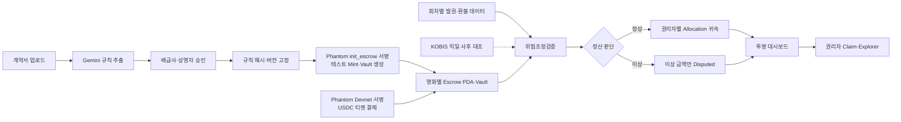
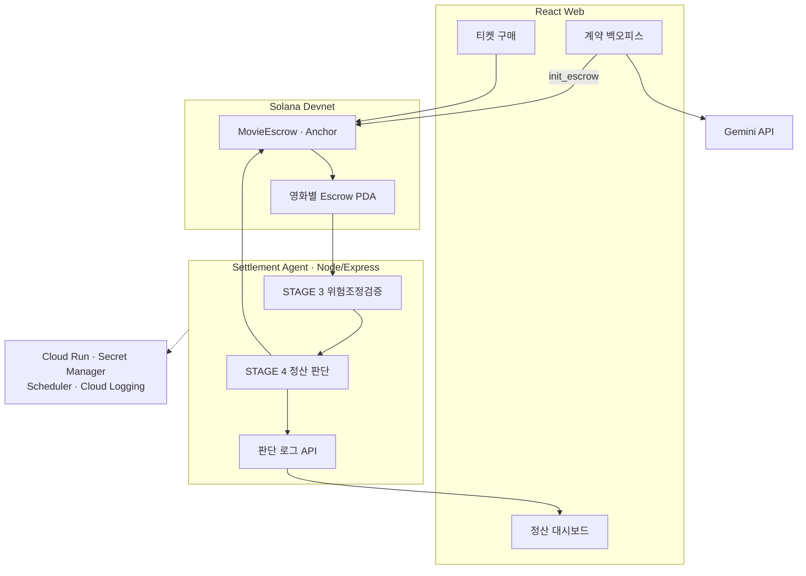

<div align="center">


<h1>MovieEscrow</h1>

**독립영화 티켓 매출을 계약대로 분리하고 지급하는 AI 온체인 정산 인프라**

계약서를 실행 가능한 규칙으로 바꾸고, 결제금을 영화별 Escrow에 격리합니다.
정상 금액은 권리자별로 귀속하고 문제가 있는 금액만 분리해 보류합니다.

<br />

[](https://chaincrew-web-612802760361.asia-northeast3.run.app)
[](docs/e2e/ChainCrew_Hackathon_Submission.html)

<br />

<em>AI는 돈을 임의로 나누지 않습니다. 사람이 승인한 결정론적 규칙이 분배를
실행하고, AI는 계약 해석과 집행 전 검증·이상 탐지를 담당합니다.</em>

</div>

---

## Demo & Submission

| 제출물         | 링크·상태                                                                                                               |
| -------------- | ----------------------------------------------------------------------------------------------------------------------- |
| Live Demo      | [Google Cloud Run에서 실행](https://chaincrew-web-612802760361.asia-northeast3.run.app)                                 |
| Demo Video     | YouTube 업로드 후 공개 영상 URL 연결 예정                                                                               |
| Presentation   | Canva 작업 완료 후 **보기 전용** 발표자료 URL 연결 예정                                                                 |
| Project Report | [HTML 보고서](docs/e2e/ChainCrew_Hackathon_Submission.html) · [PDF 보고서](docs/e2e/ChainCrew_Hackathon_Submission.pdf) |

심사용 Live Demo 접속정보는 제출 채널을 통해 별도로 전달합니다.

---

## Overview

국내 영화 티켓 매출은 극장 운영사나 예매 사업자에게 먼저 집중된 뒤 배급사,
제작사와 투자자에게 사후 정산됩니다. 중간 사업자에게 유동성 문제나 회생·파산이
발생하면 이미 판매된 표의 권리자 몫까지 운영자금과 함께 묶일 수 있습니다.

**MovieEscrow**는 티켓 결제금을 영화별 Solana 에스크로 PDA로 직접
유입시켜 사업자의 자금과 분리합니다. AI 에이전트는 사람이 승인한 계약 규칙과
회차별 발권·환불 입력, 과거 상영관 이력과 온체인 계정 상태를 검증합니다. 정상
금액은 권리자별로 귀속하고, 문제가 있는 회차·금액만 `Disputed` 상태로 격리한 뒤
각 권리자가 자기 몫을 인출합니다.

초기 대상은 새로운 결제·정산 레일을 빠르게 적용할 수 있는 **독립·예술영화
전용관, 영화제와 공동체 상영 조직**입니다. 관객용 암호화폐 서비스가 아니라,
관객 결제 뒤에서 작동하는 **B2B 정산 인프라**입니다.

---

## Why We Built This

2026년 메가박스중앙의 회생절차 과정에서 제작·수입·배급사와 위탁상영 사업자의
미지급 정산금 문제가 현실화됐습니다. 영화인연대는 이 정산채권이 영화산업의
제작·배급·상영 순환을 구성한다는 점을 강조하며 중소 사업자 보호와 정산금 분리
관리를 요구했습니다. 이후 보도에서는 배급사 미지급금이 약 150억 원, 전국 70여
개 위탁상영관의 미정산액이 약 70억~80억 원으로 추정됐습니다.

- [영화인연대 — 메가박스중앙 미지급 정산금 문제에 대한 입장문](https://kifv.org/725)
- [연합뉴스 — 메가박스 악재에 돈줄 막힌 영화계](https://www.yna.co.kr/view/AKR20260717054700005)

이 사례가 보여준 문제는 “매출 데이터가 보이지 않는다”는 것만이 아닙니다. 관객이
이미 낸 돈 가운데 권리자에게 돌아가야 할 몫이 중간 사업자의 운영자금과 분리되지
않아, 한 사업자의 재무 위험이 영화 생태계 전체의 현금흐름으로 전파된다는
점입니다.

### KOBIS 다음에 필요한 것

[KOBIS 영화관입장권통합전산망](https://www.kobis.or.kr/kobis/business/main/main.do)은
전국 영화관의 발권정보를 실시간으로 집계해 매출 데이터와 영화산업 통계의
투명성을 높입니다. 그러나 영화별 계약을 해석하거나 권리자별 금액을 격리하고 실제
지급을 실행하는 시스템은 아닙니다.

현장 운영의 전송 시점은 극장·발권 솔루션에 따라 다를 수 있습니다. 2026년 7월
씨네큐브 답변에서는 상영일 다음 날 새벽에 발권 솔루션이 일 1회 일괄 전송한다고
확인됐습니다. 따라서 제품은 KOBIS를 결제 직후 정산의 유일한 실시간 원천으로
가정하지 않고, 극장 발권 원장과 솔루션 API를 1차 입력으로 사용하며 KOBIS를 사후
대조 자료로 활용합니다. [현장 조사 정리](docs/research/CINECUBE_FIELD_RESPONSE_2026-07-31.md)

```text
KOBIS
→ 얼마가 판매됐는지 저장·집계

MovieEscrow
→ 어떤 계약 규칙을 적용할지 확정
→ 공제와 권리자별 몫 계산
→ 자금 격리
→ 정상 금액 지급
→ 이상 금액만 보류
```

> **KOBIS가 영화별 매출의 발생 사실을 보여주는 데이터 인프라라면,
> MovieEscrow는 그 데이터를 승인된 계약 규칙과 실제 자금 흐름에 연결해 권리자의
> 몫을 확정·격리·지급하는 실행 인프라입니다.**

---

## Problem

| 대상                 | 현재 겪는 문제                                                               |
| -------------------- | ---------------------------------------------------------------------------- |
| 극장·상영자          | 매출과 정산 대상 금액이 운영자금에 섞이고, 수작업 정산 부담이 큽니다.        |
| 배급사·제작사·투자자 | 언제 어떤 규칙으로 얼마가 계산됐는지 실시간으로 확인하기 어렵습니다.         |
| 정산 담당자          | 계약 해석, 공제 계산, 발권·환불 대조와 지급이 분리돼 오류 추적이 어렵습니다. |
| 모든 권리자          | 이상 한 건이 발생하면 정상 금액까지 함께 정산이 중단될 수 있습니다.          |

핵심 문제는 단순히 계산이 느리다는 것이 아닙니다. **돈이 처음부터 권리자별로
보호되지 않고**, 계산과 지급의 근거를 제3자가 즉시 검증하기 어렵다는 구조적
문제입니다.

---

## Solution

1. Gemini가 계약서에서 부율·수수료·MG·공제·정산일을 근거 조항과 함께
   구조화합니다.
2. 배급사와 상영자가 추출 결과를 확인하고 승인합니다.
3. 양측 승인이 끝나면 Phantom 서명으로 `init_escrow`를 호출해 계약·규칙 해시와
   버전, 영화별 Vault를 Solana에 등록합니다.
4. 관객의 티켓 결제금이 개인키가 없는 해당 영화의 에스크로 Vault로 직접
   들어갑니다.
5. 정산 에이전트가 회차별 발권·환불 입력, 과거 상영관 이력과 온체인 계정 상태를
   바탕으로 환불률, 무료 발권과 좌석 초과를 검증합니다.
6. 정상 회차는 승인된 규칙으로 귀속·분배하고 이상 회차의 금액만 보류합니다.
7. 대시보드에서 상태, 잔액, 트랜잭션과 AI 판단 근거를 확인합니다.

> **핵심 차별점 — 부분 보류:** 1,000 중 50에만 이상이 있다면 950의 정상 정산은
> 계속 진행하고 50만 격리합니다. 문제 하나로 전체 정산을 멈추지 않습니다.

---

## Key Features

| 기능             | 설명                                                                                                  |
| ---------------- | ----------------------------------------------------------------------------------------------------- |
| 계약 → 규칙      | Gemini가 정산 조건과 근거 조항을 추출하고, 양측 승인 후 `init_escrow`로 규칙 해시·버전을 등록합니다.  |
| 결제 순간 격리   | Phantom 서명으로 보낸 Devnet USDC가 영화별 에스크로 Vault에 직접 유입되어 운영자금과 섞이지 않습니다. |
| 위험조정검증     | 과거 이력에 따라 임계값을 조정하고 환불률·무료 발권·좌석 초과를 검사합니다.                           |
| 부분 보류        | 문제가 있는 회차·금액만 `Disputed`로 격리하고 정상분 지급은 중단하지 않습니다.                        |
| 인출 제한        | 각 권리자는 자기 `Claimable` 잔액까지만 인출할 수 있으며 초과 요청은 온체인에서 거부됩니다.           |
| 설명 가능한 판단 | Gemini가 적용 정책, 근거 조항과 보류 사유를 자연어 리포트로 생성합니다.                               |
| 투명 대시보드    | 상태머신, 권리자별 잔액, Explorer 링크와 판단 로그를 공개합니다.                                      |

---

## Settlement Flow



---

## System Architecture



| 서비스           | 책임                                               | 주요 연결                                     |
| ---------------- | -------------------------------------------------- | --------------------------------------------- |
| React Web        | 계약 승인, 구매 시연, 정산 결과 시각화             | Gemini, Agent API, Solana                     |
| Settlement Agent | 이력 조회, 정합성 검증, 정산 판단, 체인 호출       | Solana RPC, Gemini, Dashboard                 |
| MovieEscrow      | 자금 격리, 귀속, 부분 보류, 인출 제한과 분쟁 해결  | Solana Devnet                                 |
| Google Cloud     | Web·Agent 배포, 인증 배치 트리거, 로그·비밀값 관리 | Cloud Run, Secret Manager, Scheduler, Logging |

---

## Quick Start

### Prerequisites

| 영역        | 필요 환경                     |
| ----------- | ----------------------------- |
| Web · Agent | Node.js 22.10+, npm 10+       |
| Blockchain  | Rust, Anchor 0.31, Solana CLI |
| AI          | Gemini API Key                |
| Network     | Solana Localnet 또는 Devnet   |

```bash
git clone https://github.com/chaincrew-kr/blockchain-hackathon.git
cd blockchain-hackathon
npm install
cp .env.example .env
```

| 서비스           | 실행 명령           | 기본 주소                        |
| ---------------- | ------------------- | -------------------------------- |
| Web              | `npm run dev:web`   | `http://localhost:4020`          |
| Settlement Agent | `npm run dev:agent` | `http://localhost:4030/health`   |
| 전체 검사        | `npm run check`     | lint · typecheck · test · format |

로컬에서는 `CHAIN_MODE=stub`으로 외부 체인 호출 없이 개발할 수 있고, 제출용 Cloud
Run Agent는 `anchor` 모드로 Solana Devnet에 연결됩니다.

---

## Repository Structure

```text
blockchain-hackathon/
├── apps/
│   ├── web/                 # [A] 구매 웹 · 계약 백오피스 · 대시보드
│   └── agent/               # [D] 위험조정검증 · 정산 판단 · 로그 API
├── packages/
│   ├── ai-data/             # [A] Gemini 판정 설명 · KOBIS 클라이언트
│   └── schema/              # 팀 공용 TypeScript 인터페이스 · IDL
├── programs/
│   └── movie_escrow/        # [B·C] Anchor 에스크로 프로그램
├── tools/
│   ├── devnet-seed/         # 공동 서명 init · 테스트 민트 · Escrow 시딩
│   └── wallet/              # Localnet·Devnet 지갑 도구
├── scripts/
│   └── demo-claim.ts        # Claim · 초과 인출 · 분쟁 해제 리허설
├── docs/                    # 요구사항 · 스펙 · 실행계획 · 작업 문서
├── assets/                  # 브랜드 · README · 보고서 이미지
├── Anchor.toml
├── Cargo.toml
└── package.json
```

---

## Tech Stack

| 영역          | 기술                                                    |
| ------------- | ------------------------------------------------------- |
| Frontend      | React 19 · TypeScript · Vite                            |
| Agent Backend | Node.js · Express 5 · TypeScript                        |
| AI            | Gemini Structured Output                                |
| Blockchain    | Solana · Anchor 0.31 · Rust · PDA                       |
| Payment       | Phantom Wallet Adapter · Solana Devnet USDC             |
| Cloud         | Google Cloud Run · Secret Manager · Scheduler · Logging |
| Testing       | Vitest · TypeScript · ESLint · Prettier                 |

---

## Verified on Devnet

2026년 8월 3일 제출 빌드에서 아래 흐름을 검증했습니다.

| 검증 항목        | 결과                                                                     |
| ---------------- | ------------------------------------------------------------------------ |
| 계약 온보딩      | PDF 업로드, Gemini 규칙 추출, 충돌 탐지, 양측 승인과 `init_escrow` 연결  |
| 관객 결제        | Phantom Wallet Adapter를 통한 Devnet USDC `deposit`                      |
| 온체인 정산      | Devnet 프로그램 배포, 실제 `settle_batch` 2건과 `mark_disputed` 4건 기록 |
| 분쟁·인출        | 정상 Claim, 초과 인출 거부, 분쟁 중 인출 거부와 해제 후 Claim            |
| Settlement Agent | 위험 검증, 정상·부분 보류 판정, Anchor 트랜잭션 실행과 판단 로그 API     |
| Cloud 배포       | Web·Agent Cloud Run, Secret Manager, 인증 Scheduler와 Cloud Logging      |
| 자동 검사        | Agent 42개, AI Data 4개, Devnet Seed 3개 — 총 49개 통과                  |

---

## Team

|                                                            진규빈                                                            |                                                           정서윤                                                           |                                                        최상아                                                        |                                                           박세령                                                           |
| :--------------------------------------------------------------------------------------------------------------------------: | :------------------------------------------------------------------------------------------------------------------------: | :------------------------------------------------------------------------------------------------------------------: | :------------------------------------------------------------------------------------------------------------------------: |
| <a href="https://github.com/kyubinjin"></a> | <a href="https://github.com/youn1205"></a> | <a href="https://github.com/jj8ng"></a> | <a href="https://github.com/ryeong03"></a> |
|                                                  **A · Frontend / AI Data**                                                  |                                                 **B · Chain / Fund Flow**                                                  |                                          **C · Chain / Decision Execution**                                          |                                               **D · Agent / Decision Logic**                                               |
|                                     계약 온보딩 · 구매 웹<br>대시보드 · Gemini 프롬프트                                      |                                      에스크로 초기화 · 입금<br>환불 · 배치 귀속·정산                                       |                                          인출 제한 · 부분 보류<br>분쟁 해결                                          |                                       위험조정검증 · 정산 판단<br>Express API · 배포                                       |
|                                          [@kyubinjin](https://github.com/kyubinjin)                                          |                                          [@youn1205](https://github.com/youn1205)                                          |                                          [@jj8ng](https://github.com/jj8ng)                                          |                                          [@ryeong03](https://github.com/ryeong03)                                          |

---

## License

본 프로젝트는 [MIT License](LICENSE) 하에 배포됩니다.

<br />

<div align="center">


**Google Cloud × Solana AI Agentic Commerce Hackathon**

_Team ChainCrew — Kyubin Jin · Seoyoon Jung · Sangah Choi · Seryeong Park_

</div>
