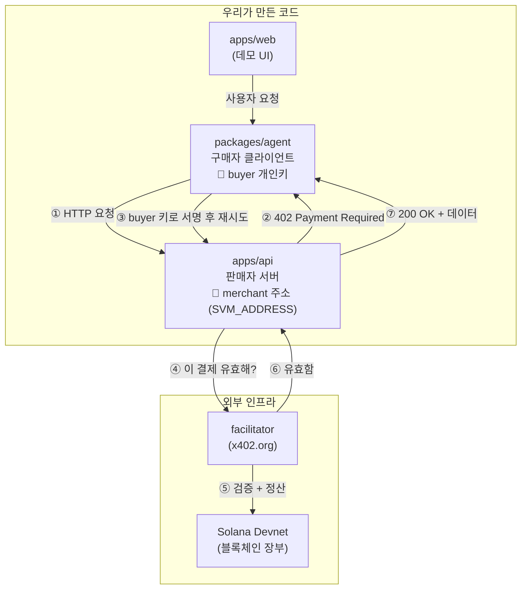

# Architecture

**buyer와 merchant 구분:** 둘은 서로 다른 지갑이며, 코드에서 읽는 값으로 나뉩니다.
구매자 클라이언트(`packages/agent`)는 **buyer 개인키**(`SVM_KEYPAIR_PATH` /
`SVM_PRIVATE_KEY`)로 결제를 서명하고, 판매자 서버(`apps/api`)는 **merchant 공개
주소**(`SVM_ADDRESS`)만 알고 "여기로 결제하라"고 알려줍니다. 서버에는 개인키가 없어,
서버가 노출돼도 지갑은 안전합니다.

## 디렉터리 경계

| 경로                  | 책임                                            |
| --------------------- | ----------------------------------------------- |
| `apps/api`            | Express API, x402 paywall, 비즈니스 엔드포인트  |
| `apps/web`            | 사용자 데모 UI                                  |
| `packages/agent`      | 에이전트 호출, 402 처리, A2A 어댑터             |
| `packages/blockchain` | 지갑 정책, 정산/영수증, 공용 Solana 온체인 코드 |
| `docs`                | 제품, 데모, 아키텍처와 운영 문서                |

MVP는 요청당 결제인 x402 `exact` 방식입니다. 장기 구독이나 반복 pull-payment가 제품
요구사항에 들어올 때만 `@solana/subscriptions`를 별도 실험 브랜치에서 검토합니다.
