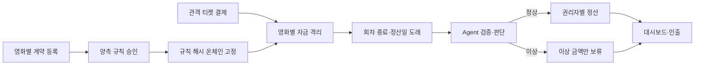
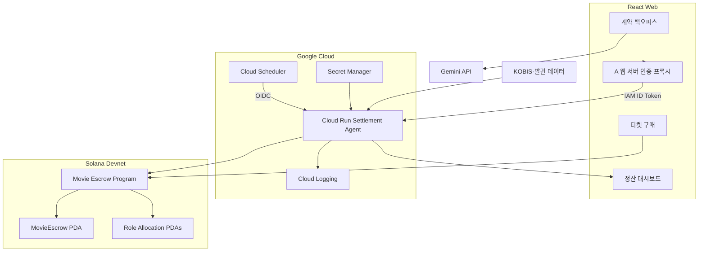
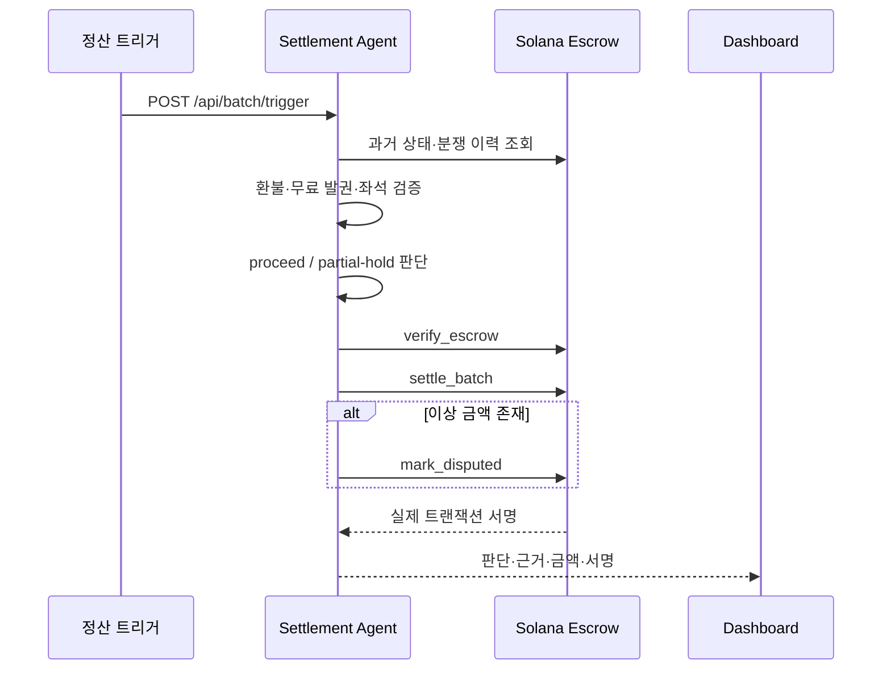

# AI Movie Settlement 프로젝트 보고서 틀

> 용도: Google × Solana AI Agentic Hackathon 프로젝트 소개서·결과 보고서 작성  
> 권장 분량: 본문 10~~15쪽 또는 발표 장표 10~~12장  
> 작성 원칙: 아래의 `[작성]`, `[선택]`, `[확인 필요]` 표시를 채운 뒤 삭제한다.

이 문서는 빈 양식이 아니라 현재 구현과 검증 결과를 반영한 **반제품 보고서**다.
이미 확인된 사실은 그대로 사용할 수 있고, 팀의 설명이나 화면이 필요한 부분만
채우면 된다.

---

## 0. 표지

### AI Movie Settlement

**AI-Powered On-Chain Settlement Infrastructure for Independent Cinema**

> 독립영화 티켓 매출을 결제 순간부터 영화별 에스크로에 격리하고, AI 에이전트가
> 계약 규칙과 발권 기록을 검증해 정상 금액은 자동 정산하며 이상 금액만
> 보류하는 B2B 정산 인프라

- 팀명: ChainCrew
- 팀원: 진규빈 · 정서윤 · 최상아 · 박세령
- 해커톤: Google × Solana AI Agentic Hackathon
- 제출일: 2026년 8월 3일
- GitHub: `[저장소 URL 입력]`
- 데모 영상: `[영상 URL 입력]`
- 라이브 Agent: `https://chaincrew-agent-dtqzxlz7hq-du.a.run.app`
  - 현재 IAM 인증 전용

`[작성]` 표지에는 저장소의 `assets/readme/repository-cover.png` 또는 핵심
대시보드 화면을 사용한다.

---

## 1. Executive Summary

### 한 문장 요약

AI Movie Settlement는 영화 티켓 매출을 영화별 Solana 에스크로에 직접 격리하고,
AI 에이전트가 승인된 계약 규칙과 발권 이력을 검증하여 정상 금액은 정산하고 이상
금액만 분쟁 상태로 보류하는 독립영화 B2B 정산 시스템이다.

### 해결하려는 문제

- 관객이 낸 티켓 매출이 중간 사업자의 운영자금과 섞인다.
- 극장·배급사·제작사·투자사 간 정산이 계약 해석과 수작업 계산에 의존한다.
- 정산 지연이나 사업자 재무 위험이 전체 권리자의 현금흐름으로 전파된다.
- 일부 거래의 이상 때문에 정상 금액까지 함께 지급이 멈춘다.

### 제안하는 해결 방식

1. 계약 조건을 구조화하고 양측 승인 후 규칙 해시로 고정한다.
2. 티켓 결제금을 영화별 에스크로 PDA에 직접 유입한다.
3. 정산 Agent가 발권·환불·무료 발권·좌석 데이터를 검증한다.
4. 승인된 결정론적 워터폴로 권리자별 금액을 계산한다.
5. 정상 금액은 지급하고 이상 금액만 `Disputed`로 격리한다.
6. 모든 판단과 거래 결과를 대시보드와 Explorer 링크로 공개한다.

### 구현 결과

- Solana Devnet 프로그램 배포 완료
- 실제 `init_escrow → deposit → verify_escrow → settle_batch → mark_disputed`
  E2E 성공
- 정상 claim, 초과 인출 거부, dispute 중 인출 차단·해제 후 인출 리허설 완료
- Agent를 Google Cloud Run에 배포하고 Secret Manager·Scheduler 구성
- 실제 Anchor 모드 `/health` 확인

---

## 2. 개발 배경과 문제 정의

### 2.1 개발 계기

국내 영화산업에서는 관객의 티켓 결제금이 극장이나 예매 사업자에게 먼저 모인 뒤
계약 비율에 따라 배급사·제작사·투자사에 사후 정산된다. 중간 사업자에게 유동성
문제나 회생·파산이 발생하면 이미 판매된 표의 권리자 몫까지 운영자금과 함께 묶일
수 있다.

`[작성]` 다음 자료를 2~3문장으로 요약하고 출처를 각주 또는 링크로 붙인다.

- 영화인연대의 메가박스중앙 미지급 정산금 입장문
- 미지급금이 중소 제작·수입·배급사와 위탁상영관에 미치는 영향
- 팀이 독립영화 정산을 주제로 선택한 이유

### 2.2 KOBIS가 있는데 왜 별도 시스템이 필요한가

KOBIS는 영화별 발권과 매출 발생 사실을 집계하는 데이터 인프라다. 하지만 다음
과정까지 수행하지는 않는다.

```text
발권 데이터 발생
→ 계약 조항 해석
→ 공제 항목 계산
→ 권리자별 귀속 금액 확정
→ 자금 분리
→ 실제 지급
→ 분쟁 금액만 보류
```

> KOBIS가 매출의 발생 사실을 보여주는 데이터 인프라라면, AI Movie Settlement는
> 그 데이터를 승인된 계약 규칙과 실제 자금 흐름에 연결하는 실행 인프라다.

### 2.3 현장 조사로 확인한 사실

씨네큐브 실무 답변에서 확인한 내용:

- 영화·상영일·회차별 관객 수와 매출을 구분해 저장한다.
- 개별 거래의 유료·무료·할인·환불 여부를 확인할 수 있다.
- 극장은 Excel로 데이터를 추출할 수 있고 솔루션 업체는 API 제공도 가능하다.
- KOBIS 전송은 상영일 다음 날 새벽 일괄 방식일 수 있다.
- 유효매출 산정 기준은 극장별 계약과 정책에 따라 달라질 수 있다.

따라서 실서비스에서는 발권 시스템·Excel·API를 1차 입력으로 사용하고, KOBIS는
사후 대조 자료로 활용한다.

### 2.4 핵심 문제 정의

| 문제             | 기존 방식                        | 필요한 변화                 |
| ---------------- | -------------------------------- | --------------------------- |
| 자금 혼합        | 티켓 매출이 운영자금과 함께 보관 | 결제 순간부터 영화별 격리   |
| 불투명한 계산    | 계약서와 Excel을 사람이 대조     | 승인된 규칙의 결정론적 실행 |
| 지급 지연        | 중간 사업자의 지급 능력에 의존   | 조건 충족 시 자동 귀속·인출 |
| 전액 정지        | 일부 이상으로 전체 정산 보류     | 이상 금액만 부분 보류       |
| 낮은 감사 가능성 | 계산 근거와 지급 기록이 분리     | 규칙·상태·거래를 함께 검증  |

---

## 3. 대상 사용자와 도입 시나리오

### 3.1 대상 사용자

- 독립·예술영화 전용관
- 영화제와 공동체·비상설 상영 조직
- 배급사·제작사·투자사 등 정산 권리자
- 계약과 정산 상태를 검토하는 운영 담당자

### 3.2 관객용 암호화폐 서비스가 아닌 이유

이 제품의 핵심 고객은 관객이 아니라 정산에 참여하는 사업자다. 해커톤 데모에서는
Solana Devnet USDC로 자금 격리 메커니즘을 보여주지만, 실서비스에서는 기존 원화
결제를 PG·신탁·에스크로 계좌와 연결하는 방식으로 확장한다.

### 3.3 도입 시나리오



---

## 4. 솔루션과 차별점

### 4.1 핵심 기능

| 기능         | 설명                                                 |
| ------------ | ---------------------------------------------------- |
| 계약 구조화  | Gemini가 부율·수수료·MG·투자 조건과 근거 조항을 추출 |
| 규칙 승인    | 배급사·상영자가 확인한 규칙만 버전과 해시로 고정     |
| 자금 격리    | 영화별 Escrow PDA에 티켓 매출 직접 유입              |
| 위험조정검증 | 환불률·무료 발권·좌석 초과·데이터 정합성 검사        |
| 워터폴 정산  | 공제·부율·수수료·MG·투자 상환·이익 배분 계산         |
| 부분 보류    | 정상 금액은 유지하고 이상 금액만 `Disputed` 처리     |
| 권리자 인출  | 자기 `Claimable` 한도 내에서만 인출 가능             |
| 감사 가능성  | 상태·판단 근거·트랜잭션 링크를 대시보드에 표시       |

### 4.2 가장 중요한 차별점: 일부만 보류

기존 정산에서는 이상 거래가 발견되면 회차나 영화 전체 지급이 정지될 수 있다.
이 시스템은 정상 금액을 계속 귀속하고 문제가 있는 역할·금액만 격리한다.

```text
정상 회차 180 USDC → 정상 정산
이상 회차  90 USDC → 규칙대로 배분 후 이상 금액만 역할별 Disputed
```

### 4.3 AI가 돈을 임의로 나누지 않는 구조

AI의 역할:

- 계약서에서 후보 규칙과 근거 조항 추출
- 발권·환불 데이터 검증
- 이상 징후 판단과 자연어 설명

결정론적 코드와 온체인 프로그램의 역할:

- 승인된 규칙 해시 검증
- 공제와 워터폴 계산
- 권리자별 귀속·보류·인출
- 권한과 상태 전이 강제

> AI는 규칙을 제안하고 집행 전에 검증하지만, 실제 돈은 사람이 승인한 규칙과
> 온체인 프로그램만 이동시킨다.

---

## 5. 왜 Solana와 Google Cloud인가

### 5.1 Solana

- 영화별 PDA로 사업자 지갑과 정산 자금을 분리한다.
- 승인 규칙과 상태 전이를 누구나 재검증할 수 있다.
- 여러 권리자의 Allocation을 독립적으로 기록한다.
- 초과 인출과 분쟁 중 인출을 프로그램 수준에서 거부한다.
- 거래 서명과 Explorer 링크로 실제 실행을 증명한다.

### 5.2 Google Cloud

- Cloud Run: 정산 Agent 상시 실행
- Secret Manager: Agent 개인키를 코드·이미지와 분리
- Cloud Scheduler: 정산일 도래를 인증된 요청으로 트리거
- Cloud Logging: 요청 ID와 실패 원인을 구조화 로그로 추적
- Gemini: 계약 조건 구조화와 판단 근거 설명

### 5.3 둘을 함께 사용하는 이유

```text
Google Cloud Agent
→ 계약·데이터 검증과 실행 시점 판단
→ Agent 권한 범위 내 트랜잭션 서명

Solana Program
→ 승인된 규칙과 상태 전이 강제
→ 자금 귀속·보류·인출 실행
→ 결과를 검증 가능한 기록으로 남김
```

Agent가 판단을 담당하고 온체인 프로그램이 권한과 자금 이동의 경계를 강제한다.

---

## 6. 시스템 아키텍처



### 주요 컴포넌트

| 컴포넌트         | 기술             | 책임                           |
| ---------------- | ---------------- | ------------------------------ |
| Web              | React·TypeScript | 계약·결제·대시보드 UI          |
| Web Server       | Express          | Gemini·KOBIS·Agent 인증 프록시 |
| Settlement Agent | Node·Express     | 검증·판단·Anchor 트랜잭션 호출 |
| Smart Contract   | Anchor·Rust      | 격리·정산·보류·인출·분쟁 해결  |
| Cloud            | Cloud Run 등     | 실행·Secret·예약·로그 관리     |

---

## 7. Agent 판단과 정산 흐름



### 현재 데모 판정

- 정상 회차 `SCR-2026-0730-14`: `proceed`
- 이상 회차 `SCR-2026-0730-23`: `partial-hold`
- 이상 근거: 무료 발권 비율이 데모 보류 임계값 초과
- 총 처리 대상: 270 USDC

`[확인 필요]` 보고서 최종본에는 이슈 #15의 미결 정책값을 “데모 정책”으로
동결했음을 명시하거나, 팀 합의 후 수정한다.

---

## 8. 구현 내용

### 8.1 온체인 프로그램

- `init_escrow`: 영화별 Escrow와 승인 규칙 등록
- `deposit`: 티켓 결제금 입금
- `refund_pending`: 정산 전 환불
- `verify_escrow`: Agent 검증 통과 기록
- `settle_batch`: 워터폴 계산과 역할별 귀속
- `mark_disputed`: 이상 금액 격리
- `resolve_dispute`: 분쟁 금액 해제 또는 처리
- `claim`: 권리자 한도 내 인출

### 8.2 정산 Agent

- Anchor IDL 기반 실제 Devnet 연결
- Program·Escrow·authority·잔액 사전 검사
- 정상·부분 보류 판정
- 역할별 `mark_disputed` 실행
- 멱등 배치 API와 오류 분류
- 판단 로그·대시보드 응답
- Cloud Run IAM 인증 운영

### 8.3 Web

- 계약서 업로드와 Gemini 추출
- 규칙 충돌 확인과 승인
- 구매·결제 시연
- 정산 배치 버튼
- Cloud Run Agent IAM 인증 프록시
- 상태·잔액·판단 근거·Explorer 링크 표시

### 8.4 Claim·분쟁 데모

`scripts/demo-claim.ts`는 별도 리허설 Escrow를 생성해 다음 세 장면을 검증한다.

1. 정상 권리자의 claim 성공
2. 남은 몫을 초과한 claim의 온체인 거부
3. dispute 중 인출 차단 → 분쟁 해제 → 인출 성공

---

## 9. 실제 검증 결과

### 9.1 배포 정보

| 항목            | 값                                             |
| --------------- | ---------------------------------------------- |
| Solana Cluster  | Devnet                                         |
| Program ID      | `C65w81oX73ngPa6PjdLR49rsXag9kM1mRD1rPT21NTik` |
| Movie ID        | `indie-2026-001`                               |
| Escrow PDA      | `6dBxfuds5za9ekG7156Ryu61jyppgpe2XmH5Vv8rowm3` |
| Agent Authority | `28jf5ZvidEmbYG4r4JBUdscWKXGwK6Kq9ij8RNVW9HnD` |
| Cloud Run       | `chaincrew-agent`                              |
| Cloud Run 상태  | IAM 인증 전용·Anchor 모드                      |
| Scheduler       | 생성 완료·현재 PAUSED                          |

### 9.2 주요 트랜잭션

| 단계            | 트랜잭션                                                                                                                                           |
| --------------- | -------------------------------------------------------------------------------------------------------------------------------------------------- |
| Escrow 생성     | [Explorer](https://explorer.solana.com/tx/3rFNeWVUBv2iVNggDEgQuUh4mGiDhVBiM6hTfzTpGGs9ZckmERp4k71CAdV7tXhjyJBEKhN6Yb7U21dHg31wTt2x?cluster=devnet) |
| 정상 회차 정산  | [Explorer](https://explorer.solana.com/tx/23amZy1z7CxKyrJ8PFQ5kqe6ZHZdyCzgS9LRHUjiREzGaxa6CkF7FSvqc1NPh2L5tHRqqUiZ7KVdAobdPp6rFPyT?cluster=devnet) |
| 이상 회차 정산  | [Explorer](https://explorer.solana.com/tx/2Htwwfdfhfbw9QyWXumUtS4EkPua39vfwVbTiWfdomiGgBxuGmwA14XqzCgZgLgkSdxffwC6GTw6uCcxRPcfSfqk?cluster=devnet) |
| 분쟁 격리       | [Explorer](https://explorer.solana.com/tx/frWMdSGtsvUG7rMMBgwwrrZr9YaJ6cEWxbn9BLqDmwwW2HniHG45yDZr9wGoXiQkya9vJ1uRsyuY5pvhijSzsEJ?cluster=devnet)  |
| Claim·거부·해제 | `[C 리허설 Explorer 링크 입력]`                                                                                                                    |

### 9.3 정산 후 상태

| 상태      |   최소 단위 |       USDC |
| --------- | ----------: | ---------: |
| Pending   |           0 |          0 |
| Allocated | 158,870,257 | 158.870257 |
| Disputed  |  79,435,129 |  79.435129 |
| Paid Out  |  31,694,614 |  31.694614 |
| 합계      | 270,000,000 | 270.000000 |

- `batchCount`: 2
- `disputeCount`: 4
- 역할 4종의 Allocation을 각각 격리했기 때문에 분쟁 카운트가 4다.

### 9.4 테스트

- Agent 테스트: 42개
- AI Data 테스트: 4개
- Devnet Seed 테스트: 3개
- 총 49개 자동 검사 통과
- 실제 Devnet E2E 별도 성공
- Cloud Run 인증 `/health`: `{"status":"ok","chain":"anchor"}`

`[작성]` CI 화면, 대시보드, Solana Explorer 중 핵심 증거 화면 2~3장을 삽입한다.

---

## 10. 보안과 신뢰 설계

### 자금·권한

- Escrow PDA에는 개인키가 없다.
- Agent는 허용된 instruction만 authority로 서명한다.
- 각 권리자는 자기 Allocation 한도 내에서만 claim할 수 있다.
- 초과 인출과 분쟁 중 인출은 온체인 프로그램이 거부한다.

### 클라우드

- Agent 개인키는 Secret Manager에 저장한다.
- 개인키를 Docker 이미지·Git·브라우저에 넣지 않는다.
- Agent Cloud Run은 IAM 인증 전용이다.
- A 웹 서버는 `chaincrew-web` 런타임 서비스 계정으로 Agent를 호출한다.
- Scheduler도 별도 최소권한 서비스 계정을 사용한다.

### AI 안전성

- AI 출력이 직접 자금을 이동시키지 않는다.
- 양측 승인과 규칙 해시 검증을 통과해야 한다.
- 실제 분배는 결정론적 코드가 수행한다.
- 판단 근거와 트랜잭션을 함께 남긴다.

---

## 11. 한계와 실서비스 확장

### 현재 MVP의 한계

- Devnet 테스트 USDC를 사용한다.
- 실제 PG·원화 결제와 연결하지 않았다.
- 실제 극장 발권 API 대신 데모 데이터를 사용한다.
- 계약·정산 정책 일부는 데모 값으로 동결했다.
- Agent 배치 상태 일부를 메모리에 저장한다.
- KYC·AML·세무·회계·법률 검토는 범위 밖이다.

### 실서비스 확장

1. 극장 발권 API·Excel 정규화 파이프라인
2. KOBIS 익일 대조와 불일치 탐지
3. 원화 PG·신탁·에스크로 계좌 연동
4. 계약별 정책 템플릿과 변경 승인 절차
5. DB 기반 멱등성·재시도·감사 로그
6. 권한 관리·키 회전·다중서명
7. 외부 증빙이 필요한 경우에만 x402 데이터 구매

### x402의 위치

x402는 핵심 정산 경로를 억지로 구성하기 위한 기능이 아니다. 다음 상황에서만
조건부로 사용한다.

- 상영관 신뢰도 데이터가 만료됐을 때
- 환불 불일치에 대한 외부 증빙이 필요할 때
- Agent 예산과 지출 한도 안에서 구매할 수 있을 때

---

## 12. 팀 구성과 기여

| 담당               | 팀원   | 주요 기여                                                    |
| ------------------ | ------ | ------------------------------------------------------------ |
| A 프론트·AI 데이터 | 진규빈 | 계약 온보딩, 구매 웹, 대시보드, Gemini·KOBIS, Agent 프록시   |
| B 체인·자금 흐름   | 정서윤 | Escrow 초기화, 입금·환불, 워터폴 정산, Devnet 시딩           |
| C 체인·판정 집행   | 최상아 | Claim, 부분 보류, 분쟁 해결, 초과 인출 거부 데모             |
| D Agent·통합       | 박세령 | 위험 검증, 정산 판단, API·공통 스키마, Devnet E2E, Cloud Run |

`[작성]` 각 팀원이 실제 맡은 작업을 2~3개의 결과 중심 문장으로 보완한다.
“조사함”보다 “무엇을 구현·검증했는지”를 쓴다.

---

## 13. 데모 시나리오

### 3분 영상 권장 구성

|      시간 | 장면              | 전달할 메시지                                         |
| --------: | ----------------- | ----------------------------------------------------- |
| 0:00~0:20 | 문제와 개발 계기  | 매출 가시성만으로는 실제 권리자 자금을 보호할 수 없음 |
| 0:20~0:45 | 계약서 추출·승인  | AI가 규칙 후보와 근거를 구조화하지만 사람이 승인      |
| 0:45~1:10 | 결제와 Escrow     | 티켓 매출이 영화별 PDA로 직접 유입                    |
| 1:10~1:45 | Agent 정산        | 정상 회차는 정산, 이상 회차만 부분 보류               |
| 1:45~2:20 | 대시보드·Explorer | 상태·금액·근거·실제 tx 증명                           |
| 2:20~2:45 | Claim 데모        | 정상 인출 성공, 초과·분쟁 중 인출 거부                |
| 2:45~3:00 | 확장성            | 독립영화에서 시작해 계약 기반 분배 인프라로 확장      |

### 데모 전 주의사항

- 현재 `indie-2026-001` Escrow는 이미 정산 완료 상태다.
- 정산 배치를 다시 호출하지 않는다.
- Claim 시연은 `scripts/demo-claim.ts`가 만든 별도 Escrow를 사용한다.
- Cloud Scheduler는 촬영 중에도 `PAUSED`로 유지한다.
- 실시간 실행이 불안정하면 이미 성공한 Explorer 기록과 대시보드 결과를 사용한다.

---

## 14. 결론

`[작성]` 다음 세 문장을 팀의 언어로 다듬는다.

1. 이 프로젝트는 영화 매출을 더 잘 계산하는 도구가 아니라, 권리자의 돈을 처음부터
   분리하고 승인된 규칙대로 집행하는 인프라다.
2. AI는 계약과 데이터 검증을 담당하고, Solana 프로그램은 자금 이동의 권한과
   불변식을 강제한다.
3. 실제 Devnet E2E를 통해 정상 금액 지급, 이상 금액 부분 보류, 초과 인출 거부가
   코드가 아닌 트랜잭션으로 동작함을 증명했다.

---

## 부록 A. 재현 방법

`[작성]` README의 실제 실행 절차와 일치하도록 최종 점검한다.

```bash
npm install
npm run check
npm run start --workspace @chaincrew/agent
npm run dev --workspace @chaincrew/web
```

- Program ID: `C65w81oX73ngPa6PjdLR49rsXag9kM1mRD1rPT21NTik`
- Devnet Explorer: `https://explorer.solana.com/?cluster=devnet`
- Cloud Run은 IAM 인증 전용이므로 공개 재현 절차와 내부 운영 절차를 구분한다.

## 부록 B. 보고서 작성 체크리스트

- [ ] 문제의 크기보다 구조적 원인을 명확히 설명했는가
- [ ] KOBIS와 제안 시스템의 역할을 구분했는가
- [ ] 관객용 코인 결제 서비스라는 오해를 막았는가
- [ ] AI와 결정론적 코드의 책임을 구분했는가
- [ ] Solana와 Google Cloud를 함께 쓰는 이유를 설명했는가
- [ ] 실제 트랜잭션 링크를 넣었는가
- [ ] Claim·초과 인출·분쟁 장면의 증거를 넣었는가
- [ ] 구현하지 않은 기능을 구현했다고 쓰지 않았는가
- [ ] Devnet·데모 데이터·정책 동결이라는 한계를 명시했는가
- [ ] GitHub·영상·라이브 URL을 넣었는가
- [ ] 모든 팀원의 기여가 결과 중심으로 적혀 있는가

## 부록 C. 장표로 바꿀 때의 10장 구성

1. 표지·한 줄 설명
2. 문제와 실제 사건
3. KOBIS 이후에 남은 빈칸
4. 대상 사용자와 도입 시나리오
5. 솔루션과 부분 보류 차별점
6. AI·Solana·Google Cloud 아키텍처
7. Agent 판단과 온체인 워터폴
8. 실제 Devnet·Cloud Run 구현 증거
9. 데모 결과·보안·한계
10. 팀·로드맵·마무리
