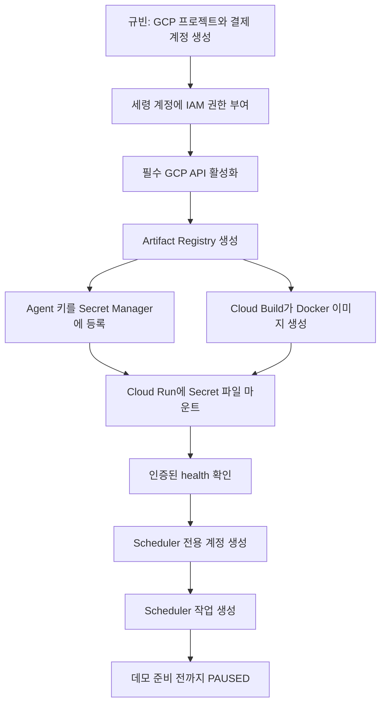
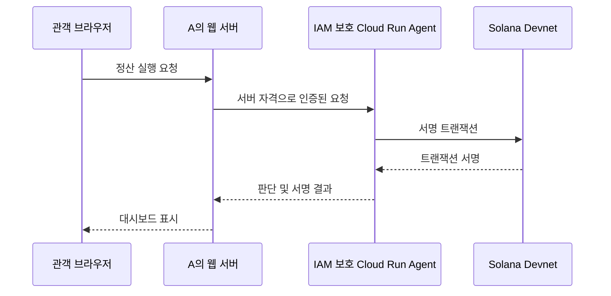

# D를 위한 GCP 배포 이해 가이드

> 작성일: 2026-08-02  
> 대상: GCP와 서버 배포가 처음인 D 박세령  
> 현재 프로젝트: `chaincrew-movie-escrow`

이 문서는 명령어를 그대로 복사하기 위한 문서이기 전에, **무엇을 왜 했는지**를
이해하기 위한 설명서다. 실제 Agent 개인키와 API 키는 절대 이 문서나 Git에
기록하지 않는다.

## 1. 우리가 배포한 것은 무엇인가

로컬에서는 다음 명령으로 정산 Agent를 실행했다.

```bash
npm run start --workspace @chaincrew/agent
```

하지만 이 방식은 노트북이 켜져 있을 때만 서버가 동작한다. Cloud Run 배포는 이
Agent를 Google 서버에서 실행해 팀원이 접근할 수 있는 URL을 만드는 작업이다.

```text
A의 웹 또는 Cloud Scheduler
        │ HTTPS 요청
        ▼
Cloud Run: chaincrew-agent
        │ Agent 키로 서명
        ▼
Solana Devnet 프로그램
        │
        ▼
settle_batch / mark_disputed
```

현재 라이브 서비스:

- GCP 프로젝트: `chaincrew-movie-escrow`
- 리전: `asia-northeast3`(서울)
- Cloud Run 서비스: `chaincrew-agent`
- Revision: `chaincrew-agent-00002-rzf`
- URL: `https://chaincrew-agent-dtqzxlz7hq-du.a.run.app`
- 접근 정책: **IAM 인증 필요**

## 2. GCP 서비스별 역할

| 서비스            | 쉽게 말하면        | 이 프로젝트에서 하는 일                  |
| ----------------- | ------------------ | ---------------------------------------- |
| GCP 프로젝트      | 클라우드 작업 공간 | 비용·권한·리소스를 한곳에 묶음           |
| Artifact Registry | Docker 이미지 창고 | 빌드한 Agent 이미지를 보관               |
| Cloud Build       | 원격 빌드 컴퓨터   | 저장소 소스로 Docker 이미지를 만듦       |
| Secret Manager    | 비밀 금고          | Agent 개인키를 Git 밖에서 보관           |
| Cloud Run         | 서버 실행 공간     | 컨테이너를 실행하고 HTTPS URL 제공       |
| Cloud Scheduler   | 예약 호출기        | 정산 시각에 배치 API를 호출              |
| IAM               | 출입 권한표        | 누가 배포·호출·Secret 조회 가능한지 제한 |

## 3. 전체 배포 흐름



핵심은 **코드와 개인키를 분리하는 것**이다. Docker 이미지에는 코드만 들어가고,
개인키는 컨테이너가 실행될 때 Secret Manager에서 파일로 붙는다.

## 4. 실제로 완료한 작업

### 4.1 프로젝트와 결제

규빈이가 프로젝트를 만들고 결제 계정을 연결한 뒤, 세령 계정
`03.ryeong@gmail.com`에 Owner 권한을 부여했다.

```bash
gcloud config set project chaincrew-movie-escrow
```

Owner는 해커톤 진행을 위해 임시로 받은 넓은 권한이다. 장기 운영에서는 필요한
역할만 부여하는 것이 안전하다.

### 4.2 API 활성화

Cloud Run 등의 제품은 프로젝트에서 API를 켜야 사용할 수 있다.

```bash
gcloud services enable \
  run.googleapis.com \
  cloudbuild.googleapis.com \
  artifactregistry.googleapis.com \
  secretmanager.googleapis.com \
  cloudscheduler.googleapis.com \
  iamcredentials.googleapis.com \
  --project chaincrew-movie-escrow
```

### 4.3 Docker 이미지 저장소

서울 리전에 `chaincrew`라는 Docker 저장소를 생성했다.

```text
asia-northeast3-docker.pkg.dev/
└── chaincrew-movie-escrow/
    └── chaincrew/
        └── agent:devnet-e2e
```

### 4.4 Agent 키 등록

로컬 파일 `.secrets/agent-devnet.json`을 `agent-devnet-key`라는 Secret으로
등록했다. 파일 내용은 명령 출력이나 Git에 포함하지 않았다.

Cloud Run에서는 다음 경로로 마운트한다.

```text
/secrets/agent-devnet.json
```

Agent 설정에는 이 경로만 전달한다.

```env
AGENT_KEYPAIR_PATH=/secrets/agent-devnet.json
```

### 4.5 이미지 빌드

모노레포는 Dockerfile이 `apps/agent/` 안에 있고 필요한 패키지는 저장소 여러
폴더에 있다. 그래서 반드시 저장소 루트를 빌드 컨텍스트로 사용한다.

```bash
gcloud builds submit --config=cloudbuild.agent.yaml . \
  --project=chaincrew-movie-escrow
```

첫 배포에서는 Dockerfile이 `@chaincrew/ai-data`를 복사하지 않아 컨테이너가
시작되지 않았다. 다음 두 항목을 Dockerfile에 추가해 해결했다.

```dockerfile
COPY packages/ai-data/package.json packages/ai-data/
COPY packages/ai-data packages/ai-data
```

### 4.6 Cloud Run 배포

Cloud Run에는 다음 종류의 설정이 들어간다.

- 공개값: Program ID, RPC URL, movie ID, 지갑 주소, 배분율
- 비밀값: Agent 개인키 Secret
- 실행 제한: CPU 1, 메모리 512MiB, 최대 인스턴스 1, 동시 요청 1

`max-instances=1`과 `concurrency=1`은 현재 Agent가 메모리에 배치 상태를 저장하기
때문에 여러 인스턴스가 동시에 같은 배치를 처리할 가능성을 줄이기 위한 데모
설정이다. 실서비스에서는 DB 또는 온체인 멱등 키가 필요하다.

## 5. 배포가 성공했는지 확인하는 방법

서비스는 IAM 인증 전용이므로 브라우저에서 URL만 열면 403이 나오는 것이
정상이다. 로그인 계정의 일회성 토큰으로 확인한다.

```bash
curl -H "Authorization: Bearer $(gcloud auth print-identity-token)" \
  https://chaincrew-agent-dtqzxlz7hq-du.a.run.app/health
```

정상 응답:

```json
{
  "status": "ok",
  "chain": "anchor"
}
```

`chain`이 `stub`이면 가짜 트랜잭션 모드이므로 성공으로 보면 안 된다.

배포 상태 확인:

```bash
gcloud run services describe chaincrew-agent \
  --region=asia-northeast3 \
  --project=chaincrew-movie-escrow
```

로그 확인:

```bash
gcloud run services logs read chaincrew-agent \
  --region=asia-northeast3 \
  --project=chaincrew-movie-escrow \
  --limit=100
```

## 6. 왜 지금 URL을 완전히 공개하지 않았나

현재 `POST /api/batch/trigger`는 요청을 받으면 Agent 개인키로 Solana 트랜잭션에
서명한다. Cloud Run을 `allow-unauthenticated`로 공개하면 인터넷의 누구나 이
엔드포인트를 호출할 수 있다.

```text
안전하지 않은 상태
아무 사용자 → 공개 batch API → Agent 키로 정산 호출
```

따라서 현재는 Cloud Run IAM이 요청자를 먼저 확인한다.

```text
현재 안전한 상태
인증된 사용자·Scheduler → Cloud Run IAM → Agent API → Solana
```

URL이 생겼다는 것과 누구나 접근할 수 있다는 것은 다른 의미다. 현재 URL은
존재하지만 인증된 요청만 받는다.

## 7. A 웹과 연결하는 방법

브라우저 프론트엔드에 GCP 서비스 계정 키를 넣으면 안 된다. 사용자가 브라우저
개발자 도구에서 키를 볼 수 있기 때문이다.

### 권장: A의 서버를 인증 프록시로 사용



A의 웹 서버용 서비스 계정에 `roles/run.invoker`만 부여한다. 브라우저에는 Agent
키나 GCP 키를 전달하지 않는다.

### 데모용 대안: 앱 수준 토큰 추가

Cloud Run을 공개하되 `POST /api/batch/trigger`에서 별도의 서버 토큰을 검사할 수
있다. 하지만 토큰을 브라우저 코드에 넣으면 다시 노출되므로, 이 방법도 최종적으로
서버 프록시와 함께 사용하는 편이 안전하다.

### 하면 안 되는 방식

- Agent 개인키를 프론트 환경변수에 넣기
- 서비스 계정 JSON을 웹 번들에 넣기
- 인증 없이 전체 Cloud Run 서비스를 공개하기
- `.secrets/`를 Git에 커밋하기

## 8. Cloud Scheduler

Scheduler는 매일 오전 3시(KST)에 다음 API를 호출하도록 생성했다.

```text
POST /api/batch/trigger
```

전용 계정:

```text
chaincrew-scheduler@chaincrew-movie-escrow.iam.gserviceaccount.com
```

이 계정에는 Cloud Run 호출 권한만 부여했다. 현재 Escrow는 이미 정산을 완료해
다시 호출하면 안 되므로 작업은 `PAUSED` 상태다.

상태 확인:

```bash
gcloud scheduler jobs describe chaincrew-settlement-batch \
  --location=asia-northeast3 \
  --project=chaincrew-movie-escrow
```

새 Escrow와 입금이 준비된 뒤에만 재개한다.

```bash
gcloud scheduler jobs resume chaincrew-settlement-batch \
  --location=asia-northeast3 \
  --project=chaincrew-movie-escrow
```

데모가 끝나면 다시 중지한다.

```bash
gcloud scheduler jobs pause chaincrew-settlement-batch \
  --location=asia-northeast3 \
  --project=chaincrew-movie-escrow
```

## 9. React 화면과 Express 서버 통합 배포

웹은 별도 URL 두 개가 아니라 하나의 Cloud Run 서비스에서 함께 제공한다.

```text
브라우저
  └─ chaincrew-web (React 정적 파일 + Express API)
       ├─ Gemini 계약서 분석
       ├─ KOBIS 조회
       └─ IAM 인증 프록시
            └─ chaincrew-agent (비공개)
                 └─ Solana Devnet
```

웹 서비스 정보:

- Cloud Run 서비스: `chaincrew-web`
- Revision: `chaincrew-web-00006-kc8` (2026-08-02, Devnet 빌드 인자 반영)
- URL: `https://chaincrew-web-612802760361.asia-northeast3.run.app`
- 런타임 계정: `chaincrew-web@chaincrew-movie-escrow.iam.gserviceaccount.com`
- 현재 접근 정책: **공개 URL + 애플리케이션 Basic Auth**

### 프론트가 바라보는 클러스터

Vite는 `VITE_*` 값을 런타임이 아니라 **빌드 타임**에 번들에 박는다. 따라서 Cloud
Run 환경변수로는 클러스터를 바꿀 수 없고, `cloudbuild.web.yaml`의 `--build-arg`가
유일한 설정 지점이다. 이 값이 비면 `apps/web/src/lib/chain.ts`의 기본값인
localnet(`127.0.0.1:8899`)으로 굳어 Phantom 결제가 항상 실패한다.

```text
VITE_SOLANA_RPC_URL=https://api.devnet.solana.com
VITE_SOLANA_CLUSTER=devnet
VITE_MOVIE_ID=indie-2026-001
```

재배포 후에는 라이브 번들을 직접 확인한다.

```bash
PW=$(gcloud secrets versions access 2 --secret=web-demo-password \
  --project=chaincrew-movie-escrow)
BASE=https://chaincrew-web-612802760361.asia-northeast3.run.app
ASSET=$(curl -s -u "chaincrew:$PW" $BASE/ | grep -o '/assets/index-[^"]*\.js')
curl -s -u "chaincrew:$PW" "$BASE$ASSET" | grep -c '127.0.0.1:8899'   # 0 이어야 한다
```

`apps/web/Dockerfile`은 먼저 Vite로 React를 빌드한 뒤, 생성된 `dist`와 Express
서버를 하나의 이미지에 넣는다. Express가 `/api/*`를 처리하고 그 밖의 GET 요청은
React 앱으로 돌려준다. 따라서 운영 프론트는 `localhost:8787`을 사용하지 않고
현재 웹 URL의 같은 origin으로 API를 호출한다.

```bash
gcloud builds submit --config=cloudbuild.web.yaml . \
  --project=chaincrew-movie-escrow
```

웹 서버는 자신의 런타임 서비스 계정으로 Agent용 ID 토큰을 자동 발급한다. 운영
환경에 서비스 계정 JSON 파일을 만들거나 전달할 필요가 없다.

```env
AGENT_BASE_URL=https://chaincrew-agent-dtqzxlz7hq-du.a.run.app
AGENT_USE_IAM_AUTH=true
```

Gemini와 KOBIS 키는 다음 Secret 이름으로 연결한다.

```text
gemini-api-key → GEMINI_API_KEY
kobis-api-key  → KOBIS_API_KEY
```

Secret 이름만 만든 것으로는 부족하다. 각각 `ENABLED` 상태의 버전이 최소 한 개
있어야 Cloud Run에서 `:latest`를 연결할 수 있다.

```bash
gcloud secrets versions list gemini-api-key \
  --project=chaincrew-movie-escrow
gcloud secrets versions list kobis-api-key \
  --project=chaincrew-movie-escrow
```

웹은 `DEMO_AUTH_USER`와 `DEMO_AUTH_PASSWORD`를 설정한 뒤 Cloud Run의 비인증
접근을 허용했다. 무인증 요청은 `401`, Basic Auth 로그인 요청은 `200`을 반환한다.
KOBIS 영화 정보 조회와 Gemini 데모 계약서 추출도 라이브 환경에서 각각 1회
검증했다. Agent는 별도 서비스이며 계속 IAM 비공개다.

## 10. 앞으로 배포할 때의 체크리스트

### 코드 변경 후

- [ ] `npm run check` 통과
- [ ] `dev` 최신화
- [ ] `cloudbuild.agent.yaml`로 새 이미지 빌드
- [ ] 웹 변경이면 `cloudbuild.web.yaml`로 새 이미지 빌드
- [ ] Cloud Run 새 Revision 배포
- [ ] 인증된 `/health`에서 `chain: anchor` 확인
- [ ] Cloud Logging에 개인키·토큰이 출력되지 않는지 확인

### 실제 배치 실행 전

- [ ] 새로운 Escrow 또는 실행 가능한 상태인지 확인
- [ ] Escrow `pending`이 배치 금액 이상인지 확인
- [ ] Agent 지갑에 Devnet SOL이 있는지 확인
- [ ] Program ID·movie ID·지갑·배분율이 Escrow 규칙과 일치하는지 확인
- [ ] Scheduler가 의도치 않게 활성화되어 있지 않은지 확인

### 팀에 전달할 값

- [ ] Cloud Run URL
- [ ] 인증 방식
- [ ] `/health` 결과
- [ ] 사용 가능한 API 경로
- [ ] Scheduler 활성화 여부
- [ ] 실패 시 확인할 Cloud Logging 위치

## 11. 현재 상태와 남은 작업

Agent 배포, 웹의 IAM 프록시 연결, API Secret 연결과 웹 공개 전환까지 완료됐다.

- [x] `gemini-api-key`, `kobis-api-key`에 실제 값 버전 추가
- [x] 두 Secret을 `chaincrew-web` 리비전에 연결
- [x] 데모용 Basic Auth 비밀번호를 Secret Manager에 등록
- [x] 인증이 설정된 것을 확인한 뒤 웹 서비스만 공개 전환
- [x] 라이브 서버에서 Gemini·KOBIS 조회를 각각 1회 검증
- [x] Devnet 빌드 인자를 넣어 재빌드·재배포하고 라이브 번들에서 확인
      (`chaincrew-web-00006-kc8`, localnet 문자열 0건)
- [ ] 팀 브라우저에서 화면 흐름과 데모 대본을 최종 리허설

### 결제 시연에 남은 차단 사항

Devnet 설정은 끝났지만, 실제 구매 트랜잭션에는 두 가지가 더 필요하다.

1. **시연 브라우저에 Phantom 확장 설치·잠금 해제.** 없으면 `chain.ts`의
   `WalletNotFoundError`가 바로 발생한다. 모바일은 Phantom 인앱 브라우저로 연다.
2. **시연 지갑에 Devnet SOL과 테스트 USDC 지급.** SOL은 faucet으로 되지만,
   USDC는 escrow가 쓰는 mint의 authority 서명이 필요하다.

```text
usdc mint      4SbQ9rufUJ9xKx4Xvjwo97pmzqn1rigyEYwaiJ5xKCrn
mint authority cRHewAqaimXM1VPHJn3icCk7JGzRYJJGT1yT2PFeWDX
escrow PDA     6dBxfuds5za9ekG7156Ryu61jyppgpe2XmH5Vv8rowm3
escrow vault   3JHN5vyYYGADRXq4CC4hQ2WfKSWDeD9a1NGT42iec5Eq
```

이 mint authority 키페어는 D의 `.secrets/`에도, Secret Manager에도 없다.
`tools/devnet-seed`를 만든 **B 정서윤**에게 시연 지갑 주소를 전달해 민팅을
요청하거나, 키페어를 안전한 경로로 전달받아야 한다. escrow 자체의 `authority`는
Agent 지갑(`28jf5Zvid…`)이라 정산 호출은 D가 그대로 할 수 있다.

Agent 서비스는 계속 IAM 비공개로 유지한다. 공개되는 것은 Basic Auth가 적용된
웹 서비스뿐이며, 웹 런타임 계정에만 Agent 호출 권한을 준다.
